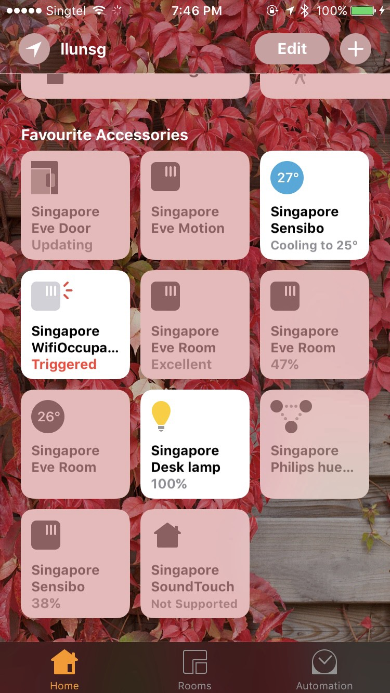
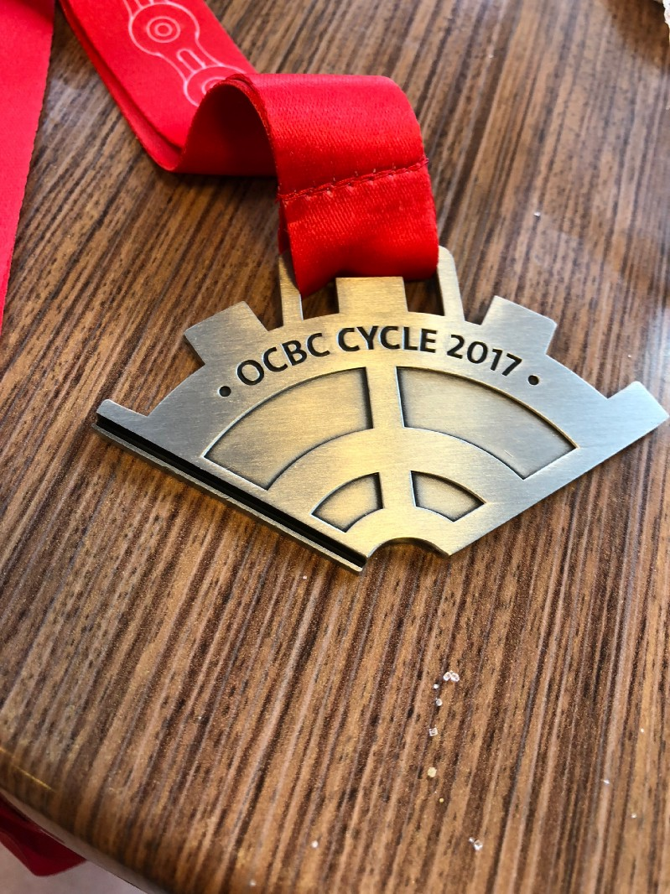
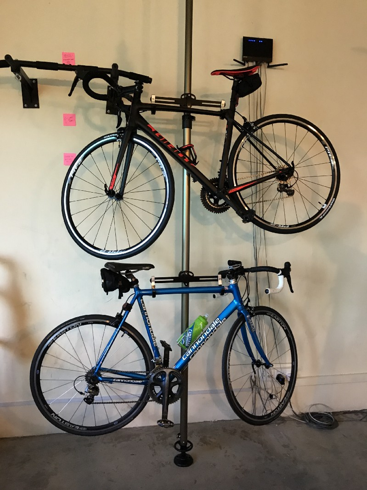
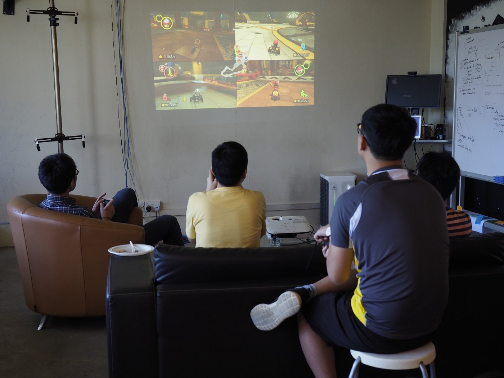

Not too sure how to describe this year. It is not too bad but also not so great. Kind of a year of fighting which is increasing in the same rate as age. Start playing with many things in the work, in free time but no traveling abroad at all (I guess this will be a thing that is happen like year and skip a year now.)

## AWS Lambda, first toy from end of 2016

This is like a research for whole year, building a lot of tools around it also contribute some back to the upstream. I am very impress with the cost and usefulness. Using as a background processing job and the cost for unused VM time is almost free or a fraction of it used to be.

Cold start is kind of problem when using it for API and serving frontend job but I guess this will improve. Tools around it is still an issue but end of year it is not so much anymore. Next year I guess this will be a lot more mature than this year and more fun.

## Home automation and my homemade router

I did not see how useful is this in the beginning. I start with only SoundTouch speaker which has wifi and http server api and just a question “Hey what I can do with this speaker” and now, in the end of year, I can control most of devices in my room with voice (which I also against it in the beginning of the year)!

With duplicate two posts, [Home Automation (with homebridge)](https://medium.com/llun/home-automation-492b3c2ec43d) and [building a router](/posts/dev/2017-06-04-building-my-own-router-and-homekit-hub/) for presence detection. It makes me learn a lot from how to compile kernel to the netlink which is a bus that can tap in for many activities in kernel. Another few things that learn from this also, how is HomeKit is far better handle offline task and rules than Google Home and also How far voice command in Google Assistant is better than Siri. I’m not play with Alexa yet because the api itself is not really easy compare to HomeKit and not very useful if it [cannot control YouTube.](http://www.business-standard.com/article/technology/google-vs-amazon-youtube-services-no-longer-available-on-fire-tv-117123000555_1.html)

## Cycling

New bike! New Jersey! New Short! I didn’t expect to cycle much this year because of office is further away from previous one but in the end I complete this year goal with one real medal from cycling event!

Not everything is perfect, almost end of the year got one fall which take me to afraid of cycling on road for sometime but now I’m back!

## Nintendo Switch

Wasting time machine of the year! For few months to complete Zelda and another few months for other games but I really love this machine. It very good toy for a party.

I carry this machine to almost every party this year. Although I have to carry charger with me too because Nintendo lock device to allow only it own charger for making it work with external display but it still worth for carry it out. So instead of I carry Macbook Pro charger I just need to carry this one (it is not enough to power my MacBook when use it as full power but enough if I just browsing the web or watching non 4k video.)

Worthy game for me would be

- Zelda breath of the wild. I think this is a game of this year too!
- MarioKart8. Good for party that don’t like fighting
- Arms. Good for party that like fighting
- Super Mario Odyssey. Good for playing after finish Zelda
- 1–2 Switch. Another good party game
- Overcooked. Party game that need really good coordinator
- Ace of the Luftwaffe. Space shooter party game that can play up to 4 players!

## End of 2017

December is kind of good and bad month for me, getting old, cake, and somehow this year, December is super busy month with a bad experience. This break in new year is hopefully make me recovery a bit and as least can fight for next year. It’s not so great year but I guess not so bad too.
