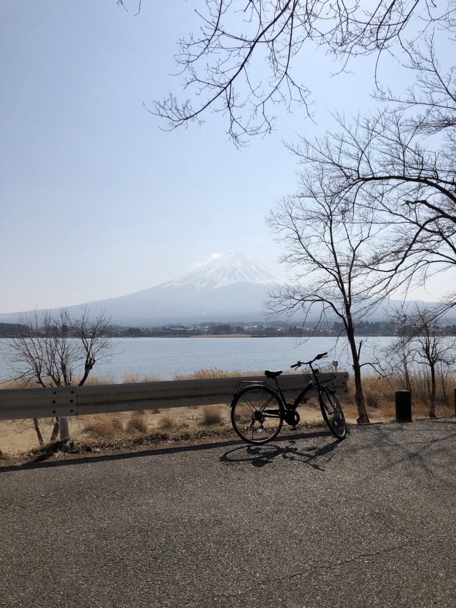
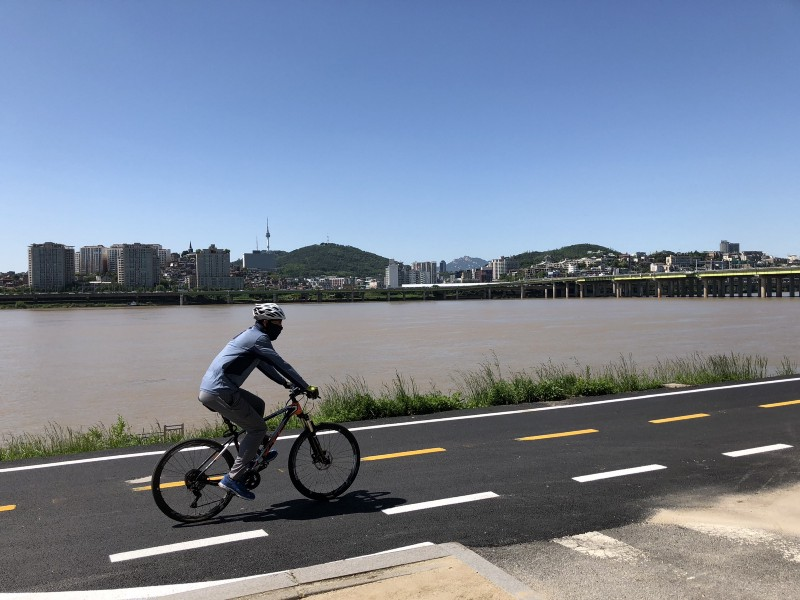
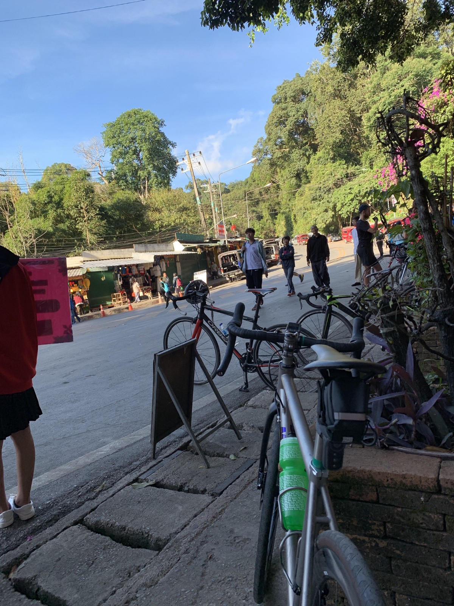
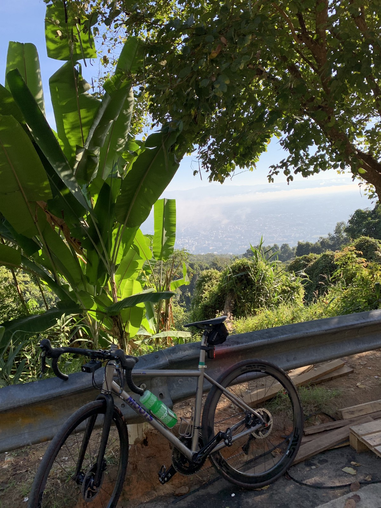
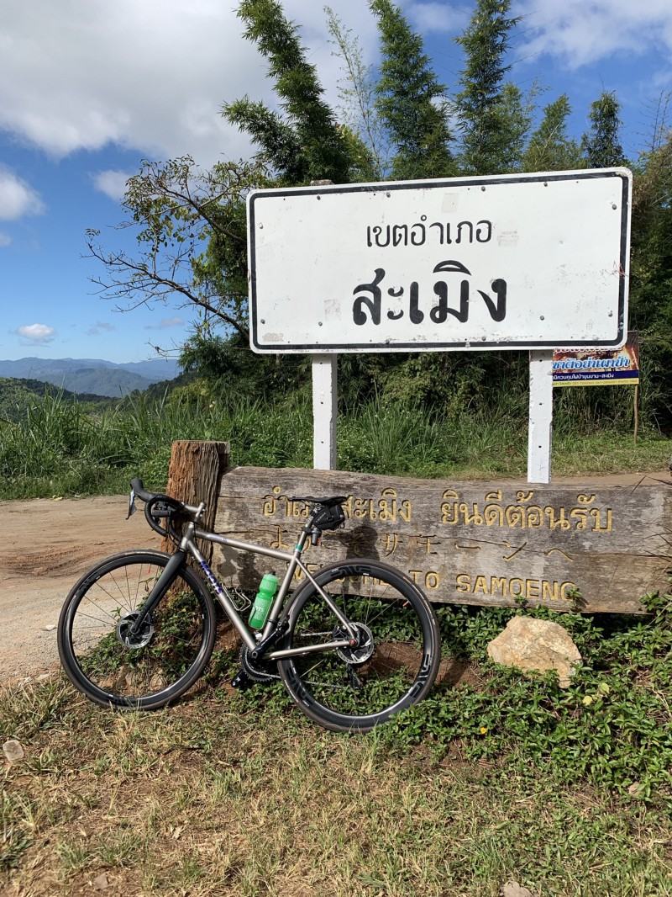
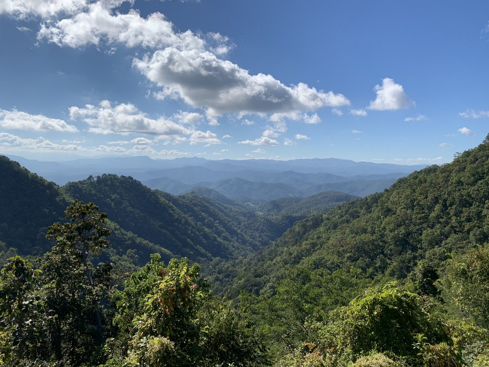

1. Start the year with 3D printed box! It took me few iterationd before starts getting useful. Found out many printer is not good for detail work and better to use CNC but the process will be different. My favorite one currently is from Hackerspace but after this month I’m getting more busy and don’t have time to spent on this.
2. February, Travel to Japan, compare to first time, I still don’t like Tokyo that much. Kawaguchiko is nice, might try to visit again in other season. Train museum is awesome might visit again when travel to Tokyo again.
   
3. March, joined two cycling events, NTU Rally and Tour de Bintan. NTU Rally is ok, the weather is quite bad, it was raining almost the whole event. Have to stop at beginning because it was pouring and I can’t see anything. Tour de Bintan is opposite, it was hot and no cloud or rain. Both organizers are good but would be better if the weather is not so extreme.
4. May, visited Seoul. The weather is so good, not too hot or cold. A lot of place to cycling and practice climbing the hill. Metro train is kind of confusing. It run in circle and to go from north to south sometime is kind of annoying or need to take a bus. Airport is huge!
   
5. Around June and July, try to move production from OpsWorks(Chef) to ECS. Kind of big project that I’m working on. Few things I learned from, infrastructure project should have only resources not application e.g. machine (EC2 instance), ECS cluster or anything that shared across applications and expose it to application to use in it own infrastructure code. Currently it mixes together which good to see overview, but Cloudformation has limitation on number of resources. So this will cause the problem in future.
6. At the same time, I tried to move database from MySQL to AWS Aurora too. As in document, it should be compatible if you use the same version and update database endpoint should be enough. In practice, It’s not. Better try with staging that has production traffic simulate on it first before switching it! However, for new product. The aurora is working great, it’s cheaper and I can use smaller instance. With the on-demand aurora that just release recently make it’s more cheaper too.
7. Money, Money, Money. Somehow many issues about money comes to me this year and I’m happy that I’m not an accountant or auditor. Parsing text file with code is fast and easy but with paper and pen. This won’t last me long than few hours.
8. Staging environment! I hope we did have this for a long time, so we can simulate problems closer to production environment without impact to the production. Building it is easy after have Cloudformation which can spawn almost the same thing with little changes. Few things need to add to make this work is anonymize data.
9. AWS Lambda, I still like it but many things change. For web api, now I prefer to put everything in one function for one domain and use API Gateway to point the group of it to this function instead of specify exact path to each function. This will make me to refactor a lot (or rewrite the whole thing) but easier to maintain. Event base application is still better to separate it but each application should be small, maybe should not have more than 5 functions.
10. Ok, no more about works. September, I have upgrade my bicycle (and hopefully my last upgrade 🤞) This is my third bike from the Brompton that I bought second hand, upgraded to Giant TCR, my first road bike last year. I still like my old TCR, I don’t have much bad experience (except I fall from it a lot in first few months when I switched to road bike) only thing I want to change was brake, from rim brake to disc brake. My upgrade choices are S-work Venge or Moots RSL Disc and end up with Moots. I don’t have bad experience with new bike yet. It works as expected in first day when I ride home under the rain! Brake power is softer than I thought when compare to mountain bike but I like it! At least it won’t throw me away over the bar. Few more things I would change later are drive train.
11. December, Chiangmai. This is my ride month! First time I fly my bicycle outside Singapore! The whole cost excluding flight (which is around S$300 + S$100 for my domestic to Bangkok) is around S$542 - Grab 6 seaters from Paya Lebar area to Changi airport, around S$40 - Airport taxi from CNX to hotel near Nimman area. 6 seaters similar to Grab but got Fortuner instead of van type. ~S$12 - Rented car with driver by hotel, ~S$60 per day for 4 seaters excludes fuel and ~S$80 per day for Fortuner. I use it for 4 days traveling around Chiang Mai and back to the airport last day with Fortuner. Fuel cost for 4 days trip is around ~S$50 - Limousine 6 seaters (Fortuner type) from BKK airport to my home, including toll and fuel, ~S$60. More expensive than normal taxi (4 seaters is around ~S$40) but their’s no queue. - Back to BKK airport, I’m trying grab van with advance booking. 6 seaters is around S$40 but I’m afraid of it can’t fit my bike box. Getting 10 seaters instead which is almost the same price as airport limousine anyway (~S$60) - The last trip will try Changi limousine, from what I heard it’s around S\$60.
    The whole logistic booking went well than I thought. I first try to book grab and limousine online but end up book at the place because I don’t know the time when I will arrive. In CNX airport, the limousine is next the exit gate and price is reasonable. Same as BKK but because my place is further away compare to CNX, the cost is a lot higher. Next time if I fly for cycling again, I would just stick to one place which will cut my cost more than half (no more cycling tour in US 😅)
12. Other than logistics for this trip is hill! (or mountains!) Chiangmai has few popular routes for cycling, Doi Suthep, Samoeng Loop, Doi Inthanon, Chiangmai - Lamphun, etc. I tried Doi Suthep first. It’s closest to my place around 15 minutes from Maya mall, and the road starts going up. I expected this will be hard but on the first time, I have to stop a lot! And almost walk in the last steep! However, the downhill is fun! Only thing I need is just keep pressing the brake and it last like half and hour! If their’s no traffic, I think speed can go up more than 60kmh (and if no curve!)

    

    

13. Samoeng loop, I thought this is easier than Doi Suthep but I’m totally wrong. Total climbing for this route is around 1.4km compare to Doi Suthep 600m. Samoeng is a lot harder and I got lost by turn to Samoeng valley cause me to climbing back. This loop make me want to change my group set from 52/36 and 11-30 to more compact (maybe 50/32 & 11-32 or better 46/30 and 11-40 in case I want to try Doi Inthanon)

    

    

14. Chiangmai - Lamphun! This is my favorite route because IT’S FLAT! Totally flat like Singapore. And the road goes along the river so it has some place to stop for taking photo. Round trip is around 90km and passing a lot of farms and rice fields and if I want to make it longer, their’s a highway route too
15. So, my 2018 is mostly work and ride. I kind of abandon all my side projects for the whole year because I cannot look at code anymore after works. 2019 I hope I can restart few side project and reduce some ride (yep, 2018 is a bit too crazy > 2x of my original goals) but still, I will keep 5k goal for next year.
16. Happy New Year.
