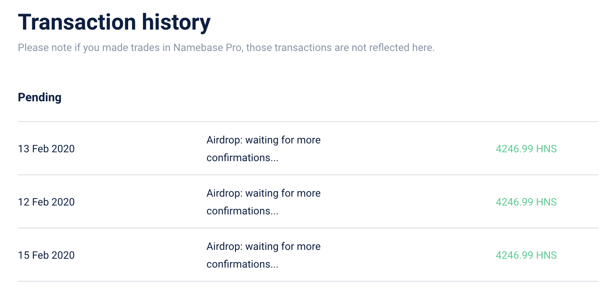
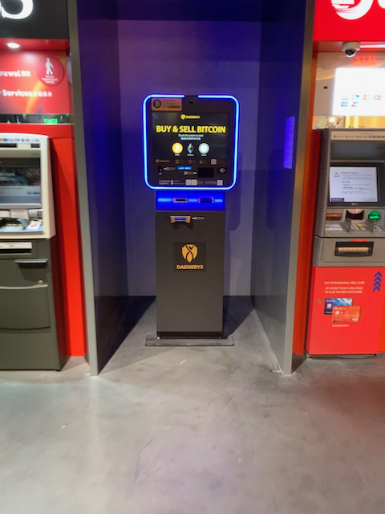
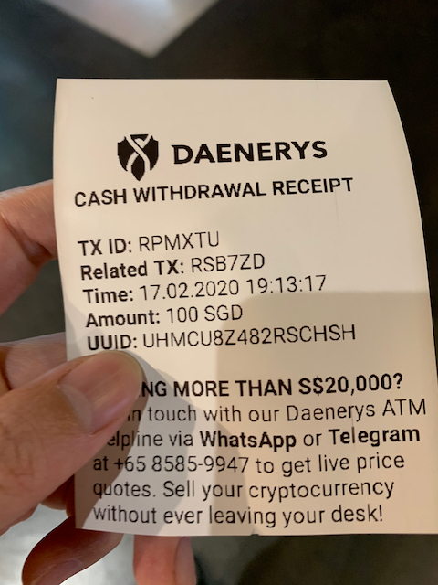

ประมาณสองสัปดาห์ที่แล้วอยู่ดีๆ เพื่อนก็ทักมาว่ามี Github Follower ช่วงปี 2018 เกิน 15 คนมั้ยแล้วก็ส่ง link เกี่ยวกับ [handshake airdrop](https://github.com/handshake-org/hs-airdrop) มาให้แล้วบอกว่าลองเอาไปเล่นดู แจกเงินอยู่ประมาณ \$2,000 กดตามไปก็คิดว่าใครมันจะแจกเงินฟรีๆ คำอธิบายใน github ก็บอกประมาณว่าไม่ได้แจกเงิน แต่แจกเป็นเหรียญ Handshake 4267 เหรียญ อ่านคำอธิบายกับ code คร่าวๆ ดูแล้วไม่น่าเสียหายอะไร เลยลองเล่นดูปรากฏว่า สองวันแรก fail ก็คุยกับเพื่อนว่าน่าจะ scam แล้วหละ จนลองหาใน twitter แล้วเจอ [tweet ที่บอกว่ารอจนกว่าจะถึง block 2016](https://twitter.com/namebasehq/status/1226698728628576258?s=21) ให้รอไปอีกประมาณ 6 วัน เพื่อนทักมาอีกทีวันเสาร์ลองอีก แต่คราวนี้ไม่ใช้ hsd กดผ่านหน้าเว็บ namebase เลยง่ายกว่า แล้วขึ้นข้อความรอ confirmation ก็คิดว่าคงไม่ได้หละ แต่ช่วงเย็นๆ ได้อีเมล์บอกว่าเหรียญเข้ามาใน wallet แล้วนะ เลยรีบโอนเหรียญเข้า btc wallet เลยเพราะได้จริง อย่างนี้ตกเร็วแน่ๆ หลังจากนั้นก็คุยบอกเพื่อน ๆ แล้วราคาแลกเป็น btc ก็ค่อยลงมาเรื่อยๆ จากวันเสาร์ที่ประมาณ 4267 ได้ 0.13 btc เหลือประมาณ [0.06 btc วันนี้](https://www.coingecko.com/en/coins/handshake)

แต่ได้ btc มาแล้วมันเอาไปใช้อะไรไม่ค่อยได้ และคิดว่าตัวเองคงไม่เล่นเหรียญพวกนี้อยู่แล้วก็เลยจะเอาออกมาเป็นเงินสดเสียเลย วิธีแรกที่เจอในสิงคโปร์คือ cash out ด้วย btc atm! [ในสิงคโปร์มีอยู่ 8 ตู้](https://coinatmradar.com/country/192/bitcoin-atm-singapore/) ตอนแรกกะว่าจะไปแลกที่ china town แต่ดูสภาพตู้แล้วไม่ค่อยน่าไว้ใจ เลยไปกดที่ funan แทน ตู้ที่ funan อยู่ชั้น b2 ติดกับ food court ลงบันไดเลื่อนมาสองชั้นแล้วเดินไปตรงกลุ่มตู้ atm ก็เจอเลย สภาพตู้ก็ประมาณนี้ อยู่ระกว่างตู้ atm อื่นๆ

ก่อนจะกดเอาเงินได้ก็ต้องสมัครมาชิกกับตู้กัน ที่ตู้จะมีช่องให้แสกนภาพ กดตามขั้นตอนบนจอแล้วเอา passport/ic แนบจากนั้นก็รอ sms มาบอกประมาณครึ่งชั่วโมง จากนั้นก็กลับไปที่ตู้อีกทีเพื่อกดเงินแล้วจะได้ wallet address มา ให้โอน btc เข้าไปกับ receipt ไว้เอาเงิน จากนั้นรอประมาณ 40 นาที! ก็จะได้ sms มาอีกทีให้เอา receipt ไปแสกนเพื่อเอาเงินออกมา รวมแล้วใช้เวลาทั้งหมดเป็นชั่วโมงเพื่อเงินที่กดได้สูงสุดแต่ละรอบ S$150 แถม rate  ที่ได้บวกลบแล้วโดนหักไปประมาณ 10% เลยเลิก (กดออกมาแค่ S$100)

วันถัดมาเลยหาวิธีโอนเข้าบัญชีตรงๆ เพื่อนก็แนะนำมาว่าให้ลอง [coinhako](https://www.coinhako.com/) หรือไม่ก็เอาเงินเก็บเข้า USDT กับ coinbase ดู กับเพื่อนอีกกลุ่มแนะนำ [MCO card](https://crypto.com/en/cards.html) แล้วลองหาเว็บเองดูเจอ [xfers.io](https://www.xfers.com/sg/) ก็สมัครมันทุกอย่างเลย ทุกเจ้าใช้วิธียืนยันตัวตนเหมือนกันหมด (แย่เหมือนกันหมด) คือถ่ายรูป selfie พร้อมถือกระดาษและ ic เขียนชื่อ website กับ วันที่ และ ic ต้องถ่ายให้อ่านออกด้วยไม่งั้นต้องกดส่งใหม่ ก็ทำอยู่ 4 - 5 รอบกับ xfers.io กว่าจะผ่านจากนั้นก็ถ่ายแบบเดียวกันส่งไปให้เจ้าอื่นๆ หลังจากยืนยันตัวตนเสร็จ xfers ก็จะมีขั้นตอนเพิ่มอีกหน่อยคือต้องยืนยัน bank account ด้วยด้วยการส่งหน้า bank statement ไปให้ด้วย ส่วน coinhako ไม่ต้อง ส่วน MCO หลังจากรอไปหนึ่งวันแล้วโดน reject ก็เลยเลิกทำต่อ

- [Coinhako](https://www.coinhako.com), มี mfa ตั้งแต่หน้าแรกดูแล้วปลอดภัยกว่า มี btc wallet ที่โอนเงินเข้ามาเก็บไว้ได้ไม่ต้องใช้ service อื่น สามารถส่งเงินเข้าบัญชีธนาคารตรง ๆ ได้เลยไม่ต้องผ่าน Xfers แต่ข้อเสียคือต้องรอ 5 - 7 วัน! (เพื่อนใช้ส่งออกมาก็รอตามนั้น สั่งโอนเข้าวันอังคารที่แล้ว พึ่งได้วันอาทิตย์ที่ผ่านมา) แต่สามารถเลือกจะส่งเข้า Xfers ได้ และได้จำนวนเงินใน Xfers ทันที
- [Xfers](https://www.xfers.com/sg), ไม่มี btc wallet ให้ตอนจะโอนเข้าเลยต้องไปเปิดกับ [Binance](https://binance.sg) ที่เป็น partner กับ Xfers (หรือจะใช้ coinhako ก็ได้) จากนั้นโอน btc เข้า Binance แล้วกดให้โอนเข้า Xfers จากนั้นกดจาก Xfers เข้า ธนาคารที่นี่อีกที ดูยุ่งยากกว่าแต่ใช้เวลา process 2 วัน ทำทั้งหมดวันอังคารได้เงินวันพุธ!

ประสบการณ์เล่นเหรียญ เอาเงินออกมาหนึ่งอาทิตย์ก็ได้ข้อสรุปกับตัวเองอย่างหนึ่งว่า คงไม่เล่นเหรียญหละ (ตอนนี้ถอนออกมาก็เหลือประมาณ 2 - 3 sgd) เพราะถอนลำบากพอสมควร เอาไว้เก็บเพื่อ value ก็เอาไปลงกับ robo advisor ดีกว่า กดเงินออกมาได้สะดวกกว่า แต่ถ้ามีคนแจกเหรียญฟรีประมาณนี้อีก ก็คงเล่นอีก รอบนี้ได้ออกมาประมาณ S\$1700 กดซื้อของเล่นได้สองสามชิ้น!
