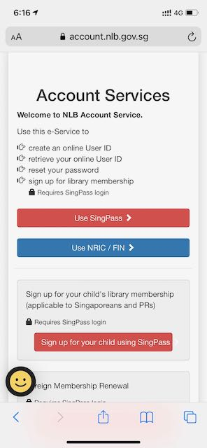
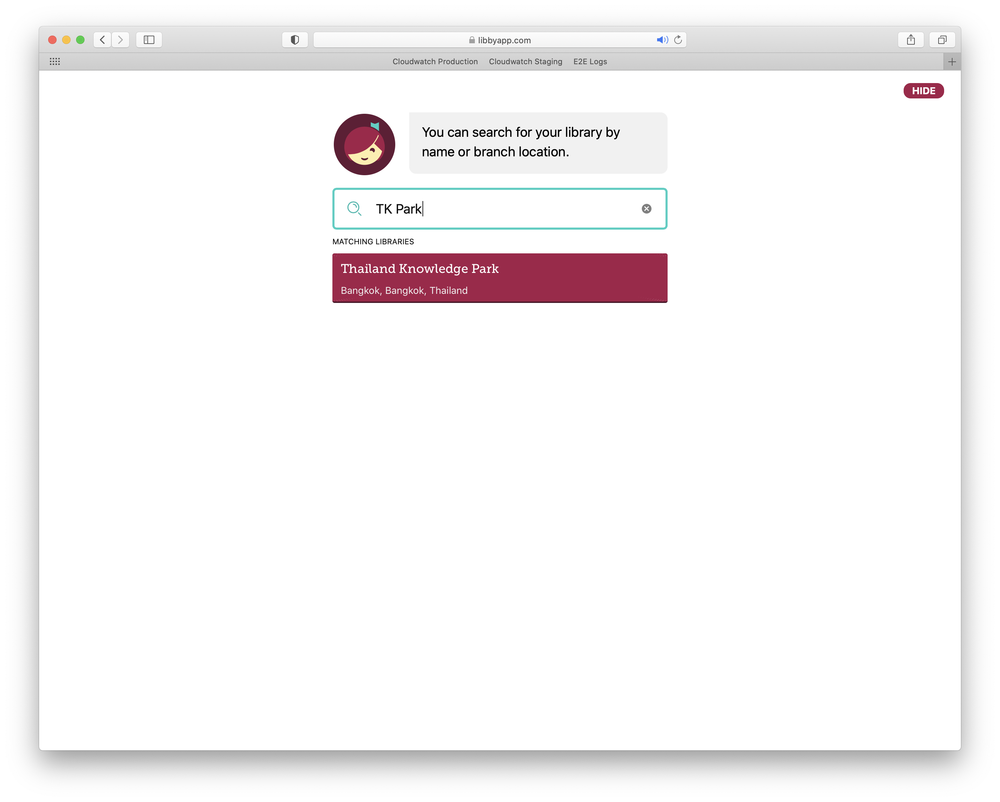
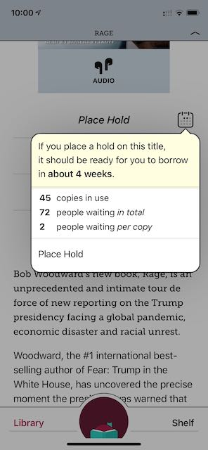
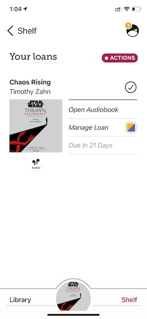

เห็นเพื่อน post ว่าช่วง covid ห้องสมุดที่นี่ National Library Board Singapore มีหนังสือเสียงให้ฟังออนไลน์ไม่ต้องไปยืมที่ห้องสมุดเลยสนใจ เพื่อนบอกว่าสามารถฟังได้จากโปรแกรมของห้องสมุดในมือถือ วันนี้ก็เลยดาวโหลดแล้วสมัครสมาชิกอย่างรวดเร็ว จากที่ไม่สนใจสมัครสมาชิกห้องสมุดที่นี่เท่าไหร่ เพราะไม่อยากยืมหนังสือเป็นเล่มมาอ่าน แล้วถึงได้รู้ว่าสมัครสมาชิกห้องสมุดที่สิงคโปร์ไม่ต้องไปสมัครที่ห้องสมุด สามารถใช้ Singpass หรือรหัสบัตรประจำตัวที่นี่สมัครออนไลน์ได้เลย กดใส่ข้อมูลจ่ายตังรายปี แล้วก็จองเวลาเข้าห้องสมุด (ช่วงนี้จำกัดคนเลยต้องจองออนไลน์ว่าจะไปใช้ห้องสมุดเมื่อไหร่) หรือยืมหนังสือผ่านหน้าเว็บได้เลย

สมัครเสร็จ จ่ายตังมีสมาชิกห้องสมุดแล้วก็ดาวโหลด Libby แล้วกดเพิ่มห้องสมุด กดหาห้องสมุดที่สมัครไว้อย่างของสิงคโปร์ใส่ชื่อประเทศหาก็จะพบเลย กดเข้าระบบด้วยรหัสที่สมัครกับห้องสมุดเสร็จก็ยืมหนังสือได้ หน้าแรกหลังจากเพิ่มห้องสมุดเสร็จก็จะมีบอกว่าขณะนี้มีหนังสือเล่มไหนที่คนสนใจเยอะบ้าง แล้วพอกดเข้าไปดูก็ดูได้อีกว่าจะยืมได้เลยหรือรอนานขนาดไหน จากที่ดูเล่มที่นานสุดที่เห็นก็ 22 อาทิตย์ หรือประมาณ 6 เดือน!

แต่เนื่องจาก Libby สามารถเพิ่มห้องสมุดได้และที่ไทยก็มีห้องสมุดที่ให้ยืมหนังสือผ่าน Libby เหมือนกันและสมัครออนไลน์ฟรีผ่านหน้าเว็บ TKPark ได้

วิธีค้นหาหนังสือที่จะยืมใน Libby จะน่าสับสนเล็กน้อย ต้องเลือกไปที่หน้าห้องสมุด จากนั้นเลือก Explore แล้วจะมีสัญลักษณ์รูปแว่นขยายให้กดพิมพ์ชื่อหนังสือหาได้บนมุมซ้าย นอกจากชื่อหนังสือแล้ว ถ้าเลือก More Options จะสามารถระบุได้ละเอียดขึ้นว่าจะค้นหาจากอะไรบ้าง และกรองประเภทหนังสือให้เจาะจงขึ้นได้ เช่น ภาษา, ชื่อคนเขียน หรือแม้แต่ประเภทหนังสือ เช่น หนังสือเสียง

หลังจากหาเจอหนังสือเสร็จ ถ้าหนังสือเล่มนั้นมีคนยืมเยอะ แล้วห้องสมุดที่เราเป็นสมาชิกมีจำนวนเล่มในระบบไม่พอโปรแกรมก็จะให้ hold หรือต่อคิวหนังสือเล่มนั้นแล้วบอกระยะเวลาว่าเราจะยืมหนังสือเล่มนั้นได้เมื่อไหร่ ถ้ายืมได้เราสามารถกด borrow แล้วเริ่มอ่านได้เลย โปรแกรมจะบอกว่าเราสามารถยืมได้นานเท่าไหร่

แต่ที่สนใจใน Libby จริงคือหนังสือเสียง แต่ก่อนสมัคร Audible แล้วจ่ายเป็นรายเดือนเพื่อให้ได้โควต้าในการกดซื้อหนังสือเสียงมาฟังเอา แต่ Libby ก็มีหนังสือเสียงที่ดังๆ ให้เราฟังเหมือนกัน (ขึ้นอยู่กับห้องสมุดที่เป็นสมาชิกว่ามีเล่มนั้นให้ฟังหรือไม่) ความต่างคือ Audible ถ้าหนังสือนั้นดังและมีคนฟังเยอะ เราสามารถฟังได้เลยไม่จำเป็นต้องต่อคิวเหมือน Audible และปริมาณหนังสือใน Audible มีเยอะกว่า (ขึ้นอยู่กับห้องสมุดที่เป็นสมาชิก) ส่วนราคา ห้องสมุดสิงคโปร์สมาชิกรายปีอยู่ที่ S$42.80 ต่อปีสำรับชาวต่างชาติ + ค่าลงทะเบียนอีก S$10.50 (ผู้พักอาศัยถาวร/คนถือสัญชาติสิงคโปร์ไม่ต้อเสียรายปี!) เทียบกับ Audible ที่ต้องจ่าย $7.95 ต่อเดือน หรือ ~$95.4 สมาชิกห้องสมุดก็ถูกกว่าพอสมควร

สำหรับคนชอบอ่านหนังสือเป็นเล่มบน ebook reader ระบบ Libby ก็มีใน ebook reader เจ้าดังๆ ทั้งสองเจ้าเหมือนกันเพียงแต่ใช้ชื่อแบรนด์เก่าว่า Overdrive ข้อเสียคือบน Kindle ตอนนี้รองรับแค่ห้องสมุดในสหรัฐอเมริกาเท่านั้น ไม่สามารถใช้กับห้องสมุดในสิงคโปร์ได้ ส่วน ebook reader ที่รองรับแถวนี้ก็มี Kobo ตัวโปรแกรมค่อนข้างใช้ยากกว่า Libby และเวลายืมหรือคืนหนังสือจะนับแยกกัน เพราะฉะนั้นเราสามารถยืมอ่านเป็นเล่มใน Overdrive ได้แล้วใช้ Libby ยืมอ่านหนังสือเสียงเพื่อฟังและอ่านคู่กัน!

ในไทยนอกจาก TKPark แล้วยังไม่เจอห้องสมุดที่มีระบบให้อ่านออนไลน์ได้เทียบเท่า และหนังสือไทยส่วนใหญ่ก็ต้องใช้โปรแกรมของ TKPark เองในการอ่าน (ซึ่งโปรแกรมก็ทำได้ดี สามารถกดอ่านได้เลยไม่ต้องจองคิว หรือขึ้นอยู่กับจำนวนหนังสือด้วย) แต่ถ้าหากว่าอยากอ่านหนังสือภาษาอังกฤษหรือฟังหนังสือเสียงภาษาอังกฤษนอกประเทศ ก็มีห้องสมุดในสหรัฐที่สามารถสมัครได้แม้อยู่นอกประเทศ

- [San Francisco Public Library](https://sflib1.sfpl.org/selfreg) ตอนนี้สามารถสมัครได้ฟรี แต่ใช้ได้ถึงมกราคม 2564 (2021) เท่านั้นหรือไม่ต้องบินไปเพื่อต่ออายุที่ห้องสมุดและแสดงว่าอยู่ที่นั้นจริงๆ
- [New York, Queens Public Library](https://queenslibrary.org/get-a-card/eUser) ค่าสมาชิก \$50 ต่อปี
- [New York, Brooklyn Public Library](https://disc.bklynlibrary.org/card/) ค่าสมาชิก \$50 ต่อปีแต่ต้องมีที่อยู่ใน US

ที่มาเขียนเพราะรู้สึกว่า Libby เป็นโปรแกรมลึกลับที่คนรู้จักน้อยมาก แต่ช่วยให้ยืมหนังสือมาอ่านได้เยอะมากและประหยัดงบให้ Amazon อย่างนึงที่รู้จากโปรแกรมนี้คือ TKPark เป็นห้องสมุดที่ดีมากใทย และดีกว่าห้องสมุดแห่งชาติเสียอีกที่ควรจะมีระบบอย่างนี้ให้ประชาชนได้ยืมอ่านหนังสือ และเข้าถึงแหล่งความรู้ได้ง่าย ไม่แน่ใจว่าเพราะหนังสือในห้องสมุดแห่งชาติเป็นหนังสือไทย และเก่าเป็นส่วนใหญ่เลยไม่สามารถ digitize ให้ขึ้นมาอ่านออนไลน์ได้ แต่หนังสือไทยใหม่ๆ ก็คิดว่าอย่างน้อยควรจะมีได้เทียบเท่า TKPark หรือมากกว่า เทียบกับห้องสมุดสิงคโปร์แล้ว ห้องสมุดแห่งชาติที่นี่มีหนังสือให้ยืมอ่านเยอะมาก และมีแม้แต่หนังสือภาษาไทย แม้จะไม่เยอะก็ตาม ก็ได้แต่อิจฉาคนที่ที่มีหนังสือให้อ่านได้ฟรีขนาดนี้จริงๆ
