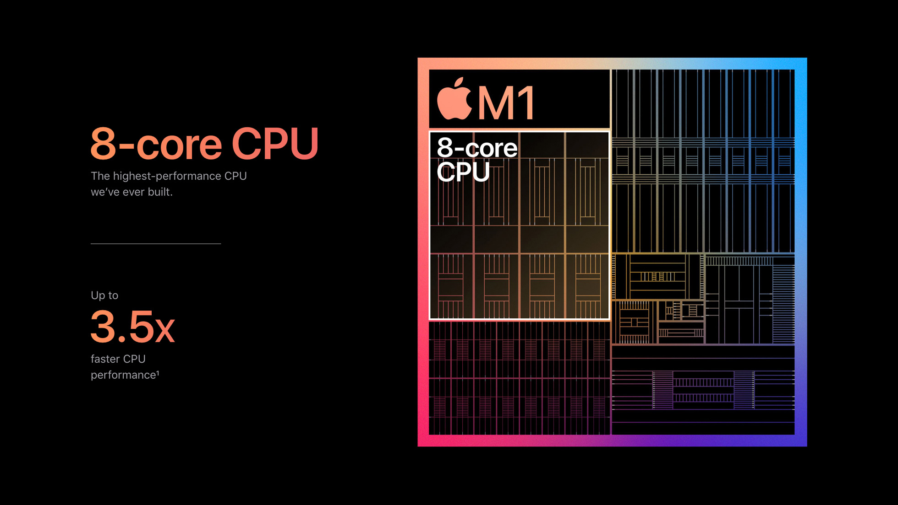

เดือนที่แล้ว Apple ออก MacBook Air/MacBook Pro 13" และ Mac mini ใหม่ออกมาสิ่งที่ทำให้ทุกคนว้าวคือ CPU ที่รอบนี้ไม่ใช่ Intel แต่เป็น CPU ที่ Apple ทำเองเอา A14 มาปรับปรุงให้แรงขึ้น ใส่ High Performance core เข้าไปเพิ่มและทำ Software ให้แปลงโปรแกรมเก่าๆ ที่เขียนมาเพื่อ CPU Intel ให้มาทำงานบน CPU ของตัวเองได้โดยที่ประสิทธิภาพตกลงไปไม่มาก

คิดว่าตอนแรกความคาดหวังของการเปลี่ยนสถาปัตยกรรม CPU คงไม่มากนักเพราะว่าที่ผ่านมาการเปลี่ยนแบบนี้มักต้องรอ Software ให้ย้ายมาใช้ code ใหม่ให้พร้อมก่อนแต่รอบนี้ที่ต่างไปคือ Apple ดันทำ CPU ได้โคตรดี ประสิทธิภาพแรงเมื่อเทียบกับราคา และพลังงานที่ใช้ แถม Rosetta2 โปรแกรมที่ใช้แปลง code ดันทำงานได้ดี ดีกว่า[ฝั่ง Microsoft ที่พึ่งออก Laptop คล้ายๆ กันรุ่นที่สอง](https://www.theverge.com/2020/10/23/21526702/microsoft-surface-pro-x-2020-review-arm-windows-10-apps-features-specs-price) แต่ความเร็วกลับไม่ต่างจากรุ่นแรก แถมโปรแกรมที่ใช้ช่วยให้โปรแกรมเก่าทำงานได้ [ก็ยังไม่สมบูรณ์จนกว่าจะปีหน้า](https://www.theverge.com/2020/9/30/21495510/microsoft-windows-on-arm-x64-app-emulation) ทำให้เดือนที่ผ่านมา เรียกว่า Apple ดึงพื้นที่สื่อไปทั้งเดือน

แต่สิ่งที่ทำให้ส่วนตัวตื่นเต้นจริงๆ แล้วไม่ใช่เพราะ M1 แรงขนาดไหน แต่ M1 กลายเป็นผลิตภัณฑ์ตัวแรกที่ออกมาบอกว่า CPU ARM สามารถเอามาใส่บน Laptop แล้วแรงเท่า CPU รุ่นสูงๆ ของฝั่ง Intel/AMD และมีโปรแกรมรองรับเพียงพอสำหรับผู้ใช้ฝั่ง producer แล้วนะ ไม่ใช้แค่ฝั่ง consumer อย่างมือถือ หรือ tablet เท่านั้น (จริงๆ tablet ก็ produce ได้แหละแต่ลักษณ์ที่ Apple ทำออกมามันจำกัดไปให้ฝั่งคนใช้ปากกา และเน้นจอเดียว - สองจอที่ใช้พื้นที่จอไม่มากไปหน่อย) มันกลายเป็นว่าคนที่ทำ CPU ให้ฝั่ง Laptop/Desktop มีมากขึ้นกว่าแต่ก่อนหลายเท่าตัว เพราะนอกจาก Apple แล้วยังมี Qualcomm, Samsung, Mediatek, Nvida และอื่นๆ อีกมากมายที่จะตามมาในอนาคตแน่นอน

อย่างเดียวที่ผิดหวังสุดจาก CPU ตัวใหม่ของ Apple รอบนี้คงเป็นวิธีที่ Apple ทำให้ระบบเร็วด้วยการจับทุกอย่างมาไว้บน die เดียวกัน แล้วทำให้การเปลี่ยน component ย่อยเป็นไปไม่ได้เลย แม้จะบอกว่าทำแบบนี้เพื่อให้ได้ประสิทธิภาพสูงสุดแต่ต้องแลกกับ flexibility ก็ยังรู้สึกว่าไม่คุ้มเท่าไหร่อยู่ดี โดยเฉพาะความเปราะบางของ hardware Apple ระยะหลังๆ ด้วยแล้ว ก็หวังว่า CPU เจ้าอื่นมาจะไล่ตาม Apple ทันและมี Software ที่ทำได้ดีพอๆ กับ Apple ในอนาคต แต่ที่แน่ๆ ปีหน้า และปีถัดๆ ไปตลาด Desktop/Laptop สนุกกว่าที่ผ่านมาที่มี CPU เจ้าตลาดแค่ Intel/AMD แน่นอน
