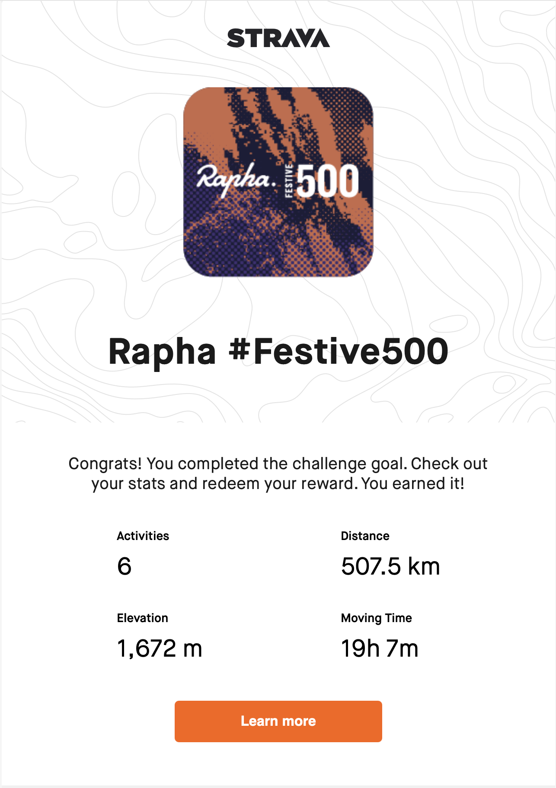

รีวิวสิ้นปีนี้ต่างจากปีก่อนหน้าทั้งหลายมาก เพราะเป็นปีที่ไม่ได้บินไปไหนเลยตั้งแต่ต้นปีต่างจากปีที่แล้วที่เดินทางเยอะมาก ซึ่งก็ไม่เลวร้ายอย่างที่คิดด้วยเพราะว่างานอยู่ในอุตสาหกรรมที่ได้ประโยชน์พอสมควรและสิงคโปร์มีกิจกรรมเยอะมาก

## COVID-19 กระทบอะไรกับชีวิตบ้าง

ก็มีตั้งแต่ปีนี้ไม่ได้บินกลับไทยเลยจากปกติจะบินกลับทุกสอง - สามเดือนครั้ง, งานปั่นจักรยาน Tour de Bintan ที่ลงไว้ยกเลิก, เลิกไปปั่นกับกลุ่มเพราะสิงคโปร์ปิดเมือง และทำงานจากที่บ้านแล้วเหมือนบ้างานมากขึ้น รวมแล้วก็ไม่ได้แล้วร้ายเท่าไหร่ แต่เหมือนมีเวลามากขึ้นปีนี้เลยทำอะไรเพิ่มขึ้นไปด้วย คือแทนที่จะเอาเงินไปบินเที่ยวก็เลยเอามาลงกับกิจกรรมในสิงคโปร์แทน

### Indoor cycling

เริ่มจากประมาณช่วงเดือนเมษายนที่สิงคโปร์เริ่มปิดเมือง ก็[ถอย Bicycle Indoor Trainer](https://www.llun.me/posts/ride/2020-05-02-indoor-cycling/) มาก่อนเลยหลังจากตอนแรกกะว่าจะเอาไว้ซื้อปั่นที่ไทยแล้วก็สมัคร Zwift ปั่นในบ้าน มันก็สนุกอยู่ช่วงนึงและปั่นในเกมเหมือนจะยากกว่าปั่นนอกบ้านเพราะมีเขา สิ่งที่ค่อนข้างต่างจากปั่นนอกบ้านก็คงเป็นความลำบากของไฟจราจรที่หายไป ลมที่ปะทะหน้าแล้วผลักให้ช้าลง แล้วก็ความไม่น่าเบื่อของวิวข้างทาง

### เรียนภาษาจีน

หลังจากนั้นกลางๆ ปีหลังจากสิงคโปร์เริ่มเปิดเมือง ก็มีไปลงเรียนจีนและสมัครสมาชิกยิม เริ่มจากเรียนจีนก่อน ที่หลายคนบอกว่าง่ายกว่าเรียนภาษาอื่นเพราะมีโทนและไวยากรคล้ายไทย ผ่านมาจะครึ่งปีเรียนกับคนจีนสองคลาส และ Duolingo แบบคู่กันเรื่อยๆ เทียบกับภาษาอังกฤษก็คิดว่าง่ายกว่า แต่อาจจะเพราะรู้แล้วว่าต้องลองพูดกับลองใช้ แล้วอยู่สิงคโปร์มันได้ใช้ นิดๆ หน่อยก็เถอะก็เลยรู้สึกว่าเรียนเร็วกว่าอังกฤษมาก

ความยากของภาษาจีนตอนนี้ที่เจอก็มีคำพ้องเสียง ที่เยอะมาก คือมีโทนแต่คำที่เสียงเดียวกัน โทนเดียวกันก็ยังมีเยอะ แล้วใช้บ่อยด้วยหลายคำ (อย่าง 的 กับ 得）ตำแหน่งของคำก็ยังไม่ค่อยชิน อย่างพวกเวลากับสถานที่ทั้งหลายจะอยู่ก่อน กรรม กับ คำขยายหมด (我早上在工作见老板 หรือ 我晚上在汉语学校学习 ประมาณนี้ ประโยคนี้ไม่รู้ถูกด้วยป่าวนะ) แต่ครึ่งปีที่รู้สึกว่าก้าวหน้าก็คงเป็น ฟังคำประกาศภาษาจีนในสถานีรถไฟฟ้าเริ่มออก กับฟังคนจีนคุยกันตามที่ต่างๆ เริ่มรู้เรื่อง!

### Gym

นอกจากเรียนจีนแล้ว อีกอย่างที่เริ่มทำก็เริ่มเข้ายิม แต่ก่อนรู้สึกว่าไม่ค่อยอยากเข้าเท่าไหร่เพราะค่าสมาชิกรายเดือนมันเยอะ และไม่รู้ว่าเล่นเครื่องเล่นยังไงด้วย แต่ยิมที่สมัครปัจจุบันมี personal trainer ที่ไม่ค่อย personal เท่าไหร่ คือทั้งยิมมีอยู่ประมาณ สามสี่คนแล้วดูคนที่มาเล่นประมาณ 10 คน แต่ก็มีจัดโปรแกรมให้ว่า ให้เริ่มเล่นอะไรบ้างกับน้ำหนักเท่าไหร่ และกินอะไรยังไง

ตอนเริ่มเล่นใหม่ๆ เรียกว่าห่วยมาก ยก dumbbell อันเล็กๆ เทียบกับลุงๆ ป้าๆ ที่มาเล่นประจำไม่ได้เลย (ตอนนี้ก็ยังไม่ได้ ไม่รู้ทำไมป้าฟิตขนาดนี้) แต่ถ้าพวกเครื่องเล่นขาทั้งหลาย นี่ง่ายมาก (ยกเว้น Squat) จนโดนตัดทิ้งไปอย่างรวดเร็วเหลือแต่ถ้าแขน กับหลังซะส่วนใหญ่ ที่ประทับใจสุดคงเป็น pull up ที่แต่ก่อนไม่เคยคิดว่าตัวเองจะทำได้ ตอนนี้ทำได้แล้ว! แม้จะได้แบบครั้งสองครั้งก็ตาม (แต่ถ้ามียางช่วย นี่สบายมาก!)

ผ่านมาหกเดือน กล้ามขึ้นมาบ้างมั้ย ก็นิดนึงแต่เป็นคนที่เรื่องมากกับการกิน (มั้ง) แบบไม่ซื้อเวย์มากินกับขี้เกียจทำอาหารเอง (มีช่วงนึงซื้อไก่มาใส่เครื่อง Air Fryer จนเบื่อ) ก็เลยขึ้นมาแบบช้าๆ แต่ตอนนี้ก็ประทับใจกับ progress นะ

### Festive 500

เนื่องจากปีนี้ติดเกาะ อย่างนึงที่เล็งว่าอยากทำมานาน (เล็งนานพอๆ กับเรียนจีน!) คือปั่น Rapha Challenge ปลายปี Festive500 ให้ได้ กติกาก็ง่ายมาก ปั่นจักรยานให้ได้ระยะทาง 500km ขึ้นไปในแปดวัน นับตั้งแต่ Christmas Eve ถึงวันสิ้นปี

สิงคโปร์เป็นประเทศที่ปั่น event นี้ง่ายสุดแล้วแต่ปกติช่วงนี้จะบินกลับไทยเลยไม่ได้เล่นเสียที ที่สิงคโปร์ปั่นง่ายเพราะว่า 1. อากาศไม่หนาว! และ 2. ถนนส่วนใหญ่ไม่มีเนิน! แผนที่คิดไว้ก็ง่ายมาก เริ่มปั่นรอบเกาะวัน Christmas Eve (ไม่ได้เป็นวันหยุดนะ แต่ทำงานอยู่บ้านปั่นให้เสร็จก่อนเริ่มงานเป็นใช้ได้) แล้วอีกสามวันถัดไปก็ปั่นวันละ 100km เหลือ 50km ไว้สัปดาห์สุดท้ายของปีเอา (เพราะไม่ได้หยุด) ก็ได้ทำตามแผนเป๊ะทุกอย่าง

อย่างนึงที่คิดว่าถ้าทำอีกจะเปลี่ยนคือ คงไปปั่นกับเพื่อนให้มากขึ้น เพราะวันที่มีคนลาก กับวันที่ไม่มีนี่แรงเหลือต่างกันมากตอนจบ ก็หวังว่าปีหน้าวัคซีนแจกทั่วถึงทุกคนแล้ว กลุ่มปั่นจะกลับมาปั่นง่ายขึ้น

## 2021

แผนปี 2021 คงไม่มีอะไรมาก ทำทุกอย่างต่อจากปีนี้ (เรียนจีน, เข้ายิมจน pull up ได้ง่ายๆ) แล้วอยู่จนได้วัคซีนที่นี่และหวังว่าการเดินทางระหว่างประเทศจะสะดวกขึ้น อย่างนึงที่เริ่มทำด้วยปีนี้คือเล่น Leetcode แต่ช่วงปีที่ผ่านมารู้สึกเหนื่อยกับการอ่าน code แก้ปัญหานู่นนี่มาก จนเลิกทำของเล่นไปช่วงนึง แม้ตอนนี้จะเริ่มกลับมาแตะโค้ดนอกเวลางานได้บ้างแล้ว แต่ก็ยังไม่รู้สึก active เท่าสมัยก่อนเท่าไหร่ ก็หวังว่า 2021 จะสามารถกลับไปเขียนโค้ดแล้วสนุกเหมือนแต่ก่อนได้อีก

Happy New Year 2021
