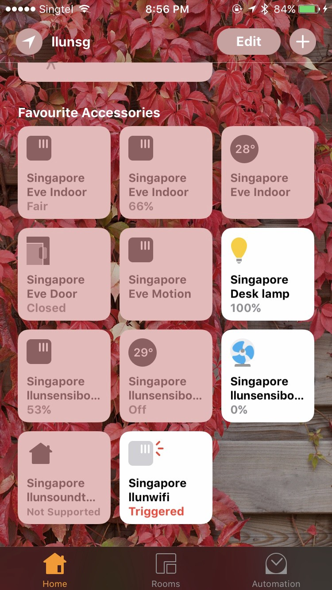
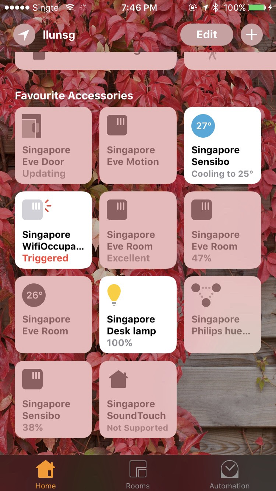

It starts with one Wifi speaker I bought last year which has HTTP server and API allow to control it programmatically. To make it connect with HomeKit at that time, I use [HomeBridge](https://github.com/nfarina/homebridge) with [SoundTouch plugin](https://github.com/CONNCTED/homebridge-soundtouch). The setup is very simple. Only one limitation, it doesn't allow to control preset. So I create my plugin and add more and more devices to the HomeKit, to the point I want everything to automate when I leave or join wifi which most router doesn't support yet.

## First version

I start with Intel NUC and wifi dongle that can find easily on the market. I already use my NUC as a router for a long time to connect from my room wifi router to the primary wifi router which owns by the landlord. This way I can isolate all my devices from other who also renting the same house.
Dongle I use in the first version is [ASUS AC-56](https://wikidevi.com/wiki/ASUS_USB-AC56), the chipset inside is [Realtek RTL8812AU](https://github.com/diederikdehaas/rtl8812AU) which can find in the Github however it is not official support from the Realtek itself. To make its work as Wifi station have to compile from the source with version 4.3.22 beta. The performance is not bad but not reliable. I have to reset every week sometime.

I change it to [TP-Link Archer T9UH](http://www.tp-link.sg/products/details/cat-11_Archer-T9UH.html) ([rtl8814AU](https://github.com/llun/rtl8814AU)) in the hope that it will be faster and more stable. However, the performance is not improved at all, so I start looking for router board.

## Second version, hardware

Because my requirement is this router have to be able to connect to the primary router via Wifi, so I need at least three wifi cards for each spectrum, two for 5 GHz and one for 2.4 GHz.

Most of the router boards in the market supports only two wifi cards, only these few brands I found so far that supports three

- [Compex WPQ864](http://www.compex.com.sg/product/wpq864/) This is the one I use because I found first and they also has wifi cards selling together.
- [ClearFog Pro](https://www.solid-run.com/marvell-armada-family/clearfog/) has only two PCI Express, but it has an M2 port which some wifi cards are using it.
- [Router Board](https://estore.alagasnetwork.sg/mikrotik/routerboard.html) I found this quite late after got the Compex board. It has more option and has OS from Mikrotik which can replace with OpenWRT.

All my wifi cards are from Compex and have from 2 MIMO card to 4 MIMO. I use the old AC Wave 1 card with [three streams MIMO](http://www.compex.com.sg/product/wle600vx/), but this can upgrade later when newer Wifi standard come out.
WPQ864 router in the foam boxOne benefit of building my router is I can choose an internal antenna. Compare to the market router that mostly uses external spider style antenna. I found only two company so far that is selling MIMO antenna in Mouser, [Touglas](http://www.mouser.sg/ProductDetail/Taoglas/FXP523A07A001/?qs=sGAEpiMZZMu6TJb8E8Cjr7j%252bpfwlA7T%2fPxI0W26r0Bs%3d) and [Pulse](http://www.mouser.sg/ProductDetail/Pulse/W6103B0100/?qs=sGAEpiMZZMuYaq4aOfOV%252bH4NNrKPTwjdKV995Qplx2A%3d) but Compex itself also selling but in the another board format for 4x4 MIMO.
My configuration is Compex864 + 3 wle600vx and 3 Taoglas Antenna.

### Build & flash firmware

Default firmware from Compex is [QSDK](http://downloads.compex.com.sg/?dir=uploads/QSDK/WPQ864/1GB-RAM) which base on old OpenWRT version and many packages are not in the branch. To install package mostly will have to compile on board again.

I switch to LEDE for more modern kernel (4.9) and however default AP148 configuration is supported only 2 PCIE cards cause my third Wifi card is not working, to enable it, I create a new DTS definition, and this might add in the future [LEDE/OpenWRT](https://github.com/llun/lede)

To build the firmware, follow the [quick build guide](https://lede-project.org/docs/guide-developer/quickstart-build-images) and choose the legacy version which will produce the artifact in the target directory.

Later follow the process base from Compex document in [readme here](http://downloads.compex.com.sg/?dir=uploads/QSDK/WPQ864/1GB-RAM/ipq806x-spf30-r030/b161206) and support I got via the conversation in email.

- Prepare TFTP server, for OSX, follow [this guide](https://rick.cogley.info/post/run-a-tftp-server-on-mac-osx/)
- Move the artifact's file into the TFTP server directory
- Set TFTP server IP address to `192.168.10.1` (This can change to any IP)
- Connect to the router via console port
  Reboot the router and enter to u-boot console by pressing any key before it start to boot the OS
- Set router IP `set ipaddr 192.168.10.20` (It can be other IP but has to be the same group with TFTP server)
- Set target TFTP server IP `set serverip 192.168.10.1` (This is the same IP as above)
- Set ethaddr to the MAC Address of the router ethernet port `set ethaddr 00:aa:bb:cc:dd:ee`
- Set boot arguments `set bootargs console=ttyMSM0,115200n8` and save `saveenv`
- Test the board can connect to the server with ping command `ping \${serverip}`
- Load firmware to router `tftpboot 0x42000000 lede-ipq806x-WPQ864-legacy-squashfs-nand-factory.ubi (Filename can be different)`
- Flash the router

```
ipq_nand linux
nand erase 0x1340000 0x4000000
nand write 0x42000000 0x1340000 \$filesize
Boot the router
```

After this adding Avahi package to the router, this will use later by HC for announcing devices that will use by HomeKit. Other than that is Luci for network management UI. It is optional and plans to remove it and build myself for more simple UI with Home automation control inside.

### HomeKit hub for Router

The most popular open source for HomeKit is [HomeBridge](https://github.com/nfarina/homebridge), but I have trouble running node.js on the board. The alternative way is building it with [Golang](https://github.com/brutella/hc)

The framework is solid, stable except the MDNS part which I have to change it and depend [on Avahi instead](https://github.com/llun/hc)

HC itself is not the same as HomeBridge. It is comparable to [Node-HAP](https://github.com/KhaosT/HAP-NodeJS) which provide the framework for talking to HomeKit, including HomeKit protocol encryption, HTTP server and MDNS service for other devices to pull information and sending a command to it.

HC can use with one single device and start it with a different port, but there is device type call hub that can use to group all device to single HC and this is what HomeBridge does.

When starts the HC/Node-HAP, it will start HTTP Server and register itself to MDNS service announce to every device that joins the HomeKit that information and control are available in this port at this address. And when HomeKit app is open on iPhone or sensor is detected something it will send information to iPad or Apple TV. Depending on what is your set as a HomeKit hub and its will check does it need to do something as automation, if it needs, it will look into MDNS for devices it needs to send a command to and encrypt the command and send to those devices via Bluetooth or Wifi network.

I start to replicate device from Node.js plugin to Golang for HC, and so far I have three devices, SoundTouch, Wifi router, and Sensibo.

### [SoundTouch](https://github.com/llun/hksoundtouch)

[SoundTouch](https://www.bose.com/en_us/products/speakers/wireless_speakers.html#multistory=group-1-panel-1) is a speaker from Bose. I choose this one because already have another Bose speaker before but I didn't expect that it has API to control. At the time, I was just looking for Wifi speaker that has standard audio input so that I can connect it to the monitor and control it with the phone.

SoundTouch is the easiest for creating a plugin. It has WebSocket, and HTTP API cover most of the functionality. I don't have an official document [which requires sending an email to contact them](http://products.bose.com/api-developer/index.html). However, (old) API document [can google for it](https://www.google.com.sg/search?q=Bose+soundtouch+api&oq=Bose+soundtouch+api&aqs=chrome..69i57j69i60j0j69i60l2.3803j0j7&sourceid=chrome&ie=UTF-8) and seems still valid.

HomeBridge plugin before convert to Golang [code is here](https://github.com/llun/homebridge-soundtouch) which I already add presets functions, so in the morning I can rotate music theme from Spotify base on the day and here is [Go version for HC.](https://github.com/llun/soundtouch-golang)

HC version is using Speaker accessory type. So it cannot control directly from the HomeKit application. I guess this will enable when Apple release it own speaker. Controlling speaker still possible by using the third party (I use Eve) also automation has to set in third party application too.

### [Sensibo](https://github.com/llun/hksensibo)

[Sensibo](https://sensibo.com/) is infrared air conditioning controller and Weather sensor. It's a cheapest so far (excluding the universal infrared like Broadlink RM) I found. An alternative is [Tado](https://www.tado.com/), [Air Patrol](http://www.airpatrol.eu/shop/airpatrol-wifi/) and [Ambi Climate](https://www.kickstarter.com/projects/ambi-labs/ambi-climate-2-ai-enhanced-air-conditioning-comfor) which version two is the same price as Sensibo now.

Few things I don't like, Sensibo is cloud base and have to send a command to online service only. If the internet is down, it's useless. Also, it does not have a battery, have to connect to the nearby USB station all the time ( an alternative is to connect it to the power bank and hang it on the wall, but it looks weird.) Maybe they might come up with the battery again similar to the first version with the same price and allow to control it locally like SoundTouch without going to the internet all the time.

HomeBridge plugin version can [found it here](https://github.com/pdlove/homebridge-sensibo) (and also [mine fork version](https://github.com/llun/homebridge-sensibo) which just convert it to ES6 in the hope it might be easier to work with.) The major issue that I found in the plugin is, Sensibo does not support applying multiple properties at the same time even thought [the API](http://static.sensibo.com/SensiboAPI_v2.yaml) allow to do it. This issue seems to cause the device state confusing, and sometimes it turns on/off air conditioning device randomly.



So in [Golang version](https://github.com/llun/hksensibo), all the command are put into the queue and send out every one second. Also, for the temperature adjustment, it will override the previous before sending out if you send multiple times (This happen because on iPhone when adjusting the temperature and release the single, it send two temperature values for two touch events, move and touch end)

### [Wifi Occupancy](https://github.com/llun/hkwifioccupancy)

In the beginning, I start with DHCP table to detect which devices are in the network. This method does not work because the TTL of record is too long to tell the device is leaving. An alternative way I found out is using iw polling wifi card status and write it to the file. HC will keep reading this file by listening to the file changes.

It is working well except some time the polling produce an empty file cause the HomeKit trigger that I'm leaving the room and turn off everything. Adjusting the timing by adding a delay before reading file seems help but still cause wrong trigger time to time.

The last method is listening to the devices change directly. The easiest way is pipe all the information from the iw to the process directly which probably work, but I didn't try this method. Another way is listening on Netlink. [This article](https://medium.com/@mdlayher/linux-netlink-and-go-part-1-netlink-4781aaeeaca8) is giving very detail what is the Netlink and how does Netlink work and I also use his library to build this detection.

Listening to Netlink for device changes, I start by [joining](https://github.com/llun/hkwifioccupancy/blob/master/netlink_presence.go#L44-L49) [`mlme`](https://github.com/llun/hkwifioccupancy/blob/master/netlink_presence.go#L44-L49) [multicast group](https://github.com/llun/hkwifioccupancy/blob/master/netlink_presence.go#L44-L49) which produce all message from the physical layer. It might not be the same for old Kernel version which these type of messages provides from [`rtmp`](https://github.com/mdlayher/netlink/blob/master/example_test.go#L63-L71) [channel](https://github.com/mdlayher/netlink/blob/master/example_test.go#L63-L71). My Kernel target is 4.9, so to use this will need to check the version of OpenWRT first.

The message comes out from `mlme` channel consists of MAC address and other information, but in this case, MAC address is enough. At the beginning of the HC process, it will get input what devices I want to use for detecting. I am in the room or not, the plugin will intersect the devices list from Netlink message and my MAC address list, when the list has any item it will trigger that I am in the room/home. Otherwise, I am outside.

### [Bridge](https://github.com/llun/hkbridge)

Last piece for putting all plugins together. This part is the same as building HomeBridge. Bridge itself is an empty accessory that contains all other devices and makes it as a child. I link other accessories by [hard coding in the import part](https://github.com/llun/hkbridge/blob/master/accessories.go#L10-L12), this might be able to change later when I can compile the accessory to the library and load it at runtime.

### Putting everything together

So at this point, I have

- ✅ Router, firmware and base packages (Avahi)
- ✅ All devices HC plugins
- ✅ HC Bridge device

Running make inside the hub will produce Compex WPQ864 binary which is ARM5 (WPQ864 itself is ARM7A, but Golang doesn't support VFPv4 yet, so have to fall back to old ARM5)

Uploading binary to the router, adding configuration

```
{
  "name": "MyBridge",
  "manufacturer": "Your own manufacturer",
  "serial": "Magic Serial Number",
  "model": "Super Awesome HomeControl bridge",
  "pin": "12345678",
  "port": "51826",
  "debug": true,
  "accessories": [
    {
      "type": "github.com/llun/hksoundtouch"
    },
    {
      "type": "github.com/llun/hkwifioccupancy",
      "option": {
        "file": "/tmp/presence.wifi",
        "addresses": [
          "mac address"
        ]
      }
    },
    {
      "type": "github.com/llun/hksensibo",
      "option": {
        "key": "sensibo-api-key"
      }
    }
  ]
}
```

Setup HomeKit by adding accessory in the iPhone, adding automation and done.



### After this, what else

Now, I start my day with Spotify music I set on the preset which automate toggle on in the morning by HomeKit. The air conditioning is turning off. I take a shower and leaving the room. Music is turning off.

Coming back home in the evening when my phone is joining wifi when walking passing outside the window, the light turns itself on, air conditioning set to temperature I like. Spotify starts playing again on the different channel.

This already good, but I still want more things to automate. The window can open itself on and off. The door lock and unlock itself when I reach home and would be better if I'm right in front of the door open it for me. The washing machine can tell me when it will finish and what time I need to take the cloth out to the dryer. More than that would be a robot that keeps my room clean which is probably the last thing I can get in far future.

But now, I need to build a box for my router first.
