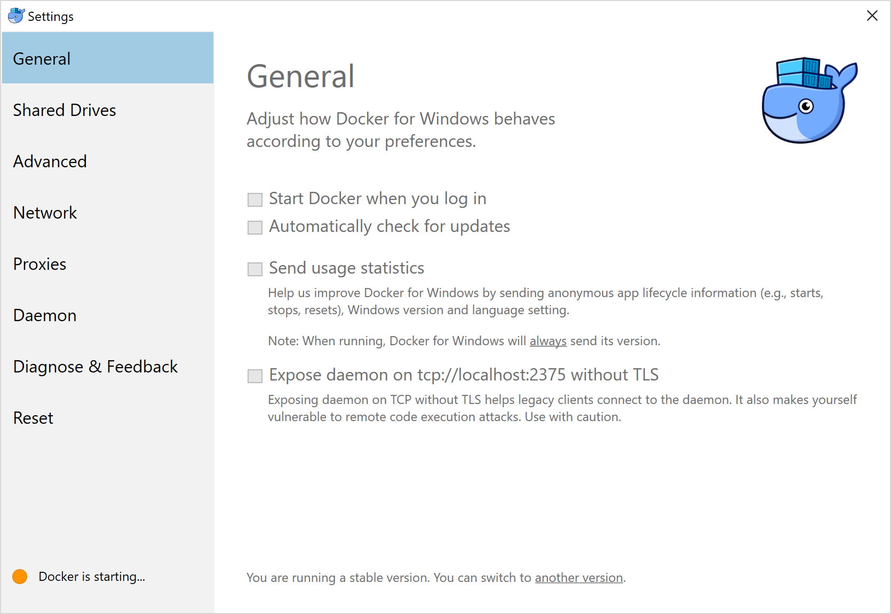

Last month after traveled to japan my MacBook Pro just went dead. It cannot charge and cannot turn on. I have to send in for servicing which took a few days. So I think it might be a good time to try out Windows machine and see can it replace my work machine.

## Tools

Most of my works are web development, some are kind of ops which is just configure AWS EC2 instance and deploy the code into production. Tools that I use most on my Mac are

- Sublime, my main editor for do almost everything. I still can’t find good alternative that fast, responsive on macOS yet. I think VS Code comes close but not that close yet.
- ssh, I ssh a lot, to enter my remote dev machine and running test or deploy my work to production.
- iMovie, this is for personal. Mostly for my bike security camera that I always get the footage out and merge all video together before upload to YouTube.
- git, well for storing the code.
- nodejs, for prettier and flowtype that need to run with editor
- yarn, "faster package installer for node"

Applications above can find alternative or have Windows version but some are not as good compare to the macOS because of few things, file system (macOS doesn’t have drive concept, file permission which Windows has a completely different view of it) So instead of

- Sublime, I switch to VSCode. Sublime can install on Windows but not all plugins are usable. The most important one is FlowIDE. VSCode has similar plugins but work better. It just a lot slower compare to Sublime. I still prefer sublime especially for large project.
- ssh, I know putty quite a long time however It’s not convenient compare to command that can use in command prompt. Windows 10 comes with Linux subsystem which help a lot on this one by enable it and use Debian for store all configuration and generate key for enter another machine.
- iMovie, I cannot find comparable software that as good as iMovie yet. So I’m still using Mac for doing video stuff.
- git, [git.org](http://git.org/) has binary that can install on Windows and it works perfectly. Minor issue would be the file permission but that can use GUI tools like github desktop to review it before commit the work. Alternatively, Linux subsystem can be use for working with git too.
- nodejs, Node.js website has Windows installation. I normally use nvm but I cannot find similar thing on Windows yet.
- yarn, [Yarn.org](http://yarn.org/) also provide the installer tool for Windows. Alternatively I think can use npm to install it too but yarn doesn’t recommend this choice.

## Docker

I use Docker a lot both development and production. Development I also use it as developer machine in remote (AWS ECS, I think most people don’t use Orchestration as development machine management but the setup itself I think can write into another blog post)

And because it’s docker image, I can run it on local machine too by just pull the image and configure it similar to the on in remote. The issue is, the container itself also need docker host for building application when I want to deploy application. Normally this can be done by just passing docker file socket in macOS but Docker for Windows doesn’t provide that file and expose the tcp socket instead.



Another issue is, docker daemon on Windows only expose the socket on localhost only. So I need to forward port to allow container to talk to Docker host. In linux or macOS, this might be just ssh local forward (I think it might have another option instead of forward the port by ssh) on Windows, there’s network shell for doing this.

```
netsh interface portproxy add v4tov4 listenport=2375 listenaddress=10.0.75.1 connectaddress=127.0.0.1
```

So from above command, I just forward `10.0.75.1:2375` to `localhost:2375` the connect port can be ignore if the port number is the same. This forward is stick in the system and will be there after restore. To remove, just run

```
netsh interface portproxy delete listenport=2375 listenaddress=10.0.75.1
```

Other than tools list above, I install it inside the linux. (rvm and ruby, nvm and nodejs, awscli, python.) The good thing of Linux subsystem is, it expose the windows drive inside too. So my workflow on Windows is just changing the files with VSCode on windows and running rails or node.js app (webpack dev server) inside the linux. When save the file, it will trigger the change inside the linux and cause those app to reload the file. The same as Docker which I will mount the drive into the container.

For a first few weeks I start with Docker and prefer to develop in it (almost exact same as production/remote developer machine environment) but it does seems docker for Windows has some limitation that cause the container corrupt and I have to reset it a few times. In the last few weeks I move to running everything inside the linux subsystem and seems fine so far. The file permission is feel weird (everything is 755 or 777) but as long as it’s not get commit into the repository should be fine.

## iOS Safari

This is the main blocker that stopping me from using Windows machine. I can use my Phone for testing however, to debug and see how’s the page is rendering is quite troublesome. The most useful tool I can find so far is [RemoteDebug iOS adapter](https://github.com/RemoteDebug/remotedebug-ios-webkit-adapter) but it really cannot compare to the simulator in XCode and Safari remote debugger at all. Not sure how can this be solve but at least still be able to test when I have the hardware.

## Conclusion

I already got my MacBook back for sometime and already switch back to it for work machine. I think if I don’t need to work with iOS that much I might be able to switch to Windows machine completely. I like the Dell hardware and Microsoft design keyboard and mouse (except the keyboard layout that’s quite too pack) I hope Apple will consider to remove touch bar and make non-touchbar more powerful than current state. (The touchbar is really useless for me when I always connect to external monitor.)

So I might consider again, but for now still have stick with MacBook for awhile.
