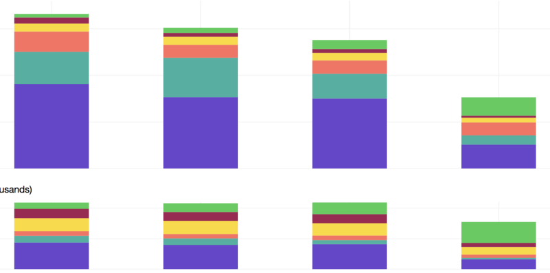

ประมาณกลางปีที่แล้ว Infrastructure ของบริษัททั้งหมดอยู่บน EC2 และ manage โดย Opsworks, อยู่ดีๆ อะไรดลใจเพื่อนก็ไม่รู้บอกว่า ลดจำนวนเครื่องของ engineer ลงได้มั้ย แล้วโครงสร้างตอนนั้นคือ engineer 1 คนจะได้ EC2 c3.large 1 เครื่อง (ซื้อ RI ไว้) ปัญหาคือ เวลาจะเพิ่มลดจำนวนเวลาคนเข้าออกลำบากมาก เพราะโดน RI กำหนดไว้ว่าต่ำสุดลดได้เท่าไหร่เลยคิดว่าจะลอง ECS/Docker กับเครื่องทั้งหมดของ engineer ดู ลองประมาณครึ่งปีถึงลงตัว (engineer เข้ามาใหม่ก็จับเข้า ECS เลย) แล้วลองเทียบ cost ดูแล้วตื่นเต้นมาก

จำนวน cost ที่ลงคือลดจำนวนเครื่องอย่างเดียวเลย แล้วแทนที่จะซื้อ RI ตามจำนวน engineer ก็ซื้อแค่ 2 เครื่องนี้แทน คนเข้าออกก็ไม่ต้องซื้อหรือเพิ่ม ec2 instance จับยัดเข้า ECS พอ

แต่พอประมาณกลางเดือนมีนา RI ของ production หมด cost ก็เริ่มพุ่งอีกครั้ง คราวนี้อยากลองอย่างอื่นที่ถูกกว่า RI และยืดหยุ่นกว่าเลยคิดว่าจะใช้ Spot Instance แทน

## ทำไมถึงใช้ Spot Instance

เหตุผลง่ายๆ เลยคือถูก และยืดหยุ่น คือถ้าเลือกถัว instance type, availbility zone และ region ดีๆ discount ที่ได้นี่อย่างน้อย 70% เลยทีเดียว เทียบกับ RI ที่โดน lock เปลี่ยนอะไรไม่ได้ 3 ปี + ดีสุดก็แค่ 75% (Spot Instance ที่เห็นดีสุดแบบไม่ใช่ t2 นี่คือ 90%) ก็แทบอยากจะย้ายมาใช้ทันที

ข้อเสียเดียวของ Spot Instance ที่ทำให้คนไม่ค่อยมาใช้คือ ราคามันเปลี่ยนแปลงและ discount ที่ได้อาจไม่เยอะ (หรือถ้าเป็น model เก่าก็แพงกว่า on-demand) แถม instance สามารถตายได้ แม้จะกำหนดราคาเต็มที่แค่ไหนก็ตาม ทำให้ถ้าใช้กับ critical service ทั้งหลายหรือ ถ้า Infrastructure management cost สูง​ (เวลาที่ใช้ในการ start เครื่องสูง) ชีวิต ops อาจจะบัดซบไปเลยก็ได้

แล้วพอเทียบกับ Infrastructure เดิมที่ใช้ opsworks กว่า EC2 จะ start จน service เข้าไปทำงานนี่มีอย่างน้อยครึ่งชั่วโมง เทียบกับ ECS ที่ถ้า EC2 ตาย แล้วเริ่ม instance ใหม่นานสุดประมาณ 10 นาที ถ้า service ที่เข้าใปทำงานเป็นแค่ daemon บางทีไม่ถึง 2 นาทีด้วยซ้ำ ข้อเสียของ Spot Instance แทบจะหมดไปทันที (แถมตอนนี้พอ AWS เปลี่ยน model คิดราคา Spot instance, เครื่องที่จองด้วย spot fleet นี่ไม่เคยตายเป็นเดือนเลย เหตุผลเรื่องความไม่แน่นอนของ instance ไม่เป็นปัญหาอีกเลย)

## ผลตอนนี้ cost ก็ได้ตามนี้

Graph บนเป็น Cost ตั้งแต่เริ่มย้าย จนมาถึงเดือนปัจจุบันที่ย้ายเกือบเสร็จแล้ว เทียบกับ graph ด้านล่างที่เป็นจำนวนเวลาที่ใช้ของ instance ทั้งหมด

ลองเทียบปีที่แล้วกับปีนี้ กับเวลาที่ต่างกันประมาณ 8 วันแต่ให้ถึงวันสุดท้ายแล้ว คิดว่ายังไงก็หายไปประมาณครึ่งนึงเลย แถมเดือนหน้าส่วนที่เป็นสีม่วงที่เป็น on-demand กลุ่มสุดท้ายจะหายไปอีก สุดท้ายแล้ว cost ด้านบนจะเหลือแค่ stack ด้านบน — สีม่วง

ถัดจากนี้เหลืออะไร optimise ได้อีกบ้าง

ถ้าทุกอย่างอยู่บน ECS แล้วก็แทบจะไม่เหลือแล้ว ถัดจากนี้ก็คงมีแค่หาทางลำสัดส่วน RI ลงหรือหาจุดสมดุลระหว่าง Spot Instance กับ RI ว่าค่าไหนที่ทำให้ critical service อยู่รอดได้ทุกเหตการณ์ กับหา ratio free spot instance ใน cluster ที่เวลา scale up, ECS สามารถ fill in spot instance ได้ก่อนที่จะ spot instance จะ scale up ตามทัน (ตอนนี้ลองที่สัดส่วน 60% utilization อยู่) คือทำหมดนี่คิดว่า สามารถ scale up ได้เร็วพอๆ กับ Fargate แน่นอน + cost ที่ถูกกว่า

ทั้งหมดนี่ก็เป็น cost optimisation ที่ทำมาประมาณครึ่งปีหละ แต่เป็นแค่ 30% ได้ของทั้งระบบ (ยังเหลือ RDS และอื่นๆ อีกเช่น AWS Lambda, etc etc)

ตอนนี้บริษัทก็รับสมัครหา [engineer เพิ่มอยู่ ใครสนใจมาทำอะไรพวกนี้ก็ลองสมัครมาได้ ตาม link นี้](https://angel.co/referralcandy/jobs/297234-product-engineer) ใครสนใจอยากเล่นอะไรพวกนี้ก็ลองสมัครเข้ามาดู
