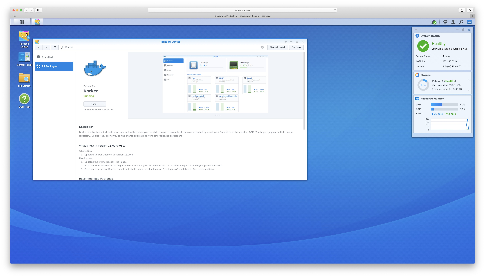
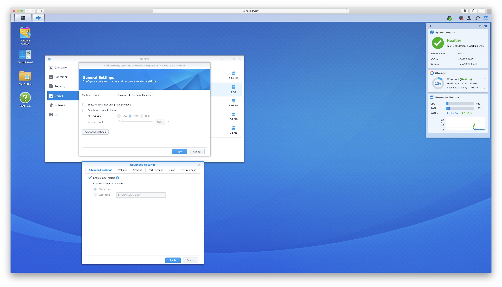
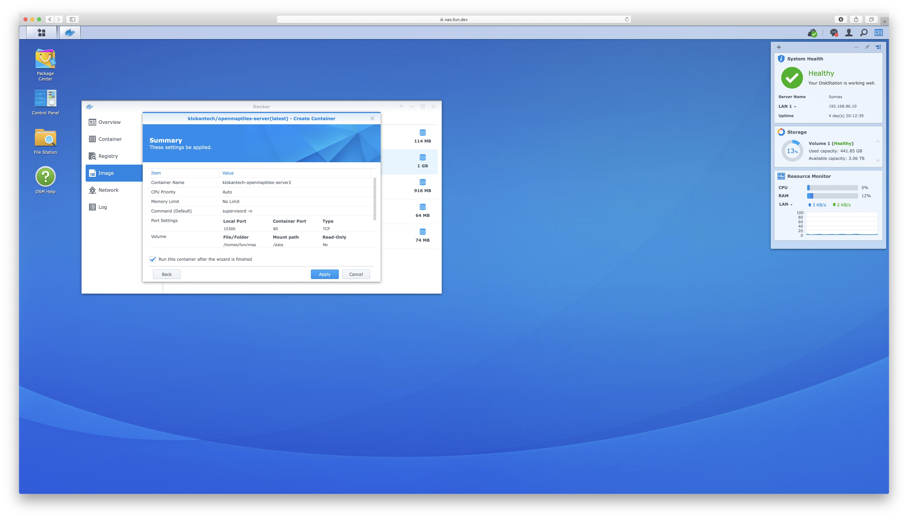
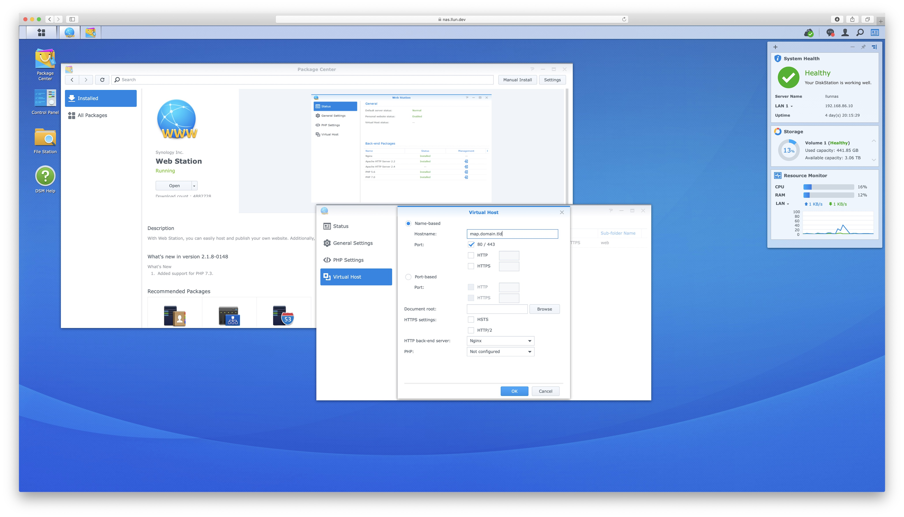

Few personal requirements for this note,

1. Have local domain that accessible without adding domain into `/etc/hosts`
1. No Apache package inside Synology
1. OpenMapTiles have to start automatically after NAS is restarted

My personal NAS model is DS218+, which has Docker package and with intel CPU, so the process might be different
for other models (especially ARM which I don't think OpenMapTiles supports it yet or has a container image for it.)
This project is for myself having map run locally and render my activity heat map over it without need of internet
connection, also, I can copy all the map file that loaded and run on my laptop why travelling e.g. on the plane.

The disk space requires for this is around 60GB (Planet map from OSM package by OpenMapTiles and OpenMapTiles container itself), so this can copy into my laptop later. Step below is for setup OpenTilesMap inside the Synology Docker service and make it run with internal nginx and green lock ssl.

- Install the Docker package inside DSM and add OpenMapTiles container in it. Step is similar to OpenMapTiles [install server in linux](https://openmaptiles.com/server/#install) but with UI from DSM

  [](synology_docker_package.jpg)

- In Advanced Settings, select `Enable auto-restart`, in volume add folder and map between folder that store a map tiles file to the `/data` and Port settings, choose local port that want to put inside nginx. I don't make it auto select here, so the port stay after restart and doesn't break nginx.

  [](docker_auto_restart.jpg)

  [](docker_port_map.jpg)

  [](docker_volume_map.jpg)

- Apply the setting and click make in run from the Summary page

  [](docker_summary.jpg)

- Install Web Station package and open it to add virtual host, click on create virtual host inside, and fill in domain in hostname, select the document root (which can be any, it doesn't matter) and click ok to create it

  [](virtual_host_configuration.jpg)

  [](web_status_and_virtual_host.jpg)

- Enable ssh service from `Control Panel/Terminal & SNMP` and ssh into it.
- Virtual host configuration that add from the UI is inside `/etc/nginx/app.d/server.webstation-vhost.conf`. In that file, it will show what's include path that allow user to add custom configuration e.g. `include /usr/local/etc/nginx/conf.d/<uuid>/user.conf*` Follow that path to the uuid directory and create a new file with name begin with `user.conf`
- Creating ssl file with let's encrypt and add those ssl files (certificate and private key) into DSM in `Control Panel/Security`. After adding, map the certificate to the domain name.
- Add the location below making nginx forward traffic to OpenMapTiles container

```
location / {
	proxy_set_header Host $host;
	proxy_set_header X-Forwarded-Proto $scheme;
	proxy_set_header X-Forwarded-Host $host;
	proxy_set_header X-Forwarded-Server $host;
	proxy_set_header X-Forwarded-For $proxy_add_x_forwarded_for;
	proxy_pass http://localhost:15300;
}
```

- Reload nginx with `synoservice --reload nginx`
