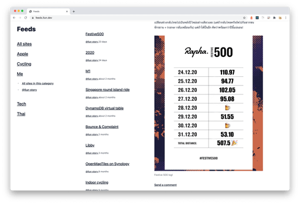
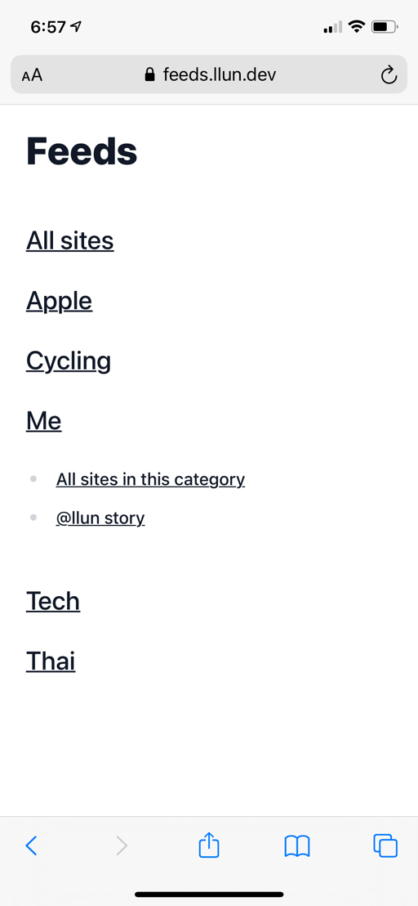
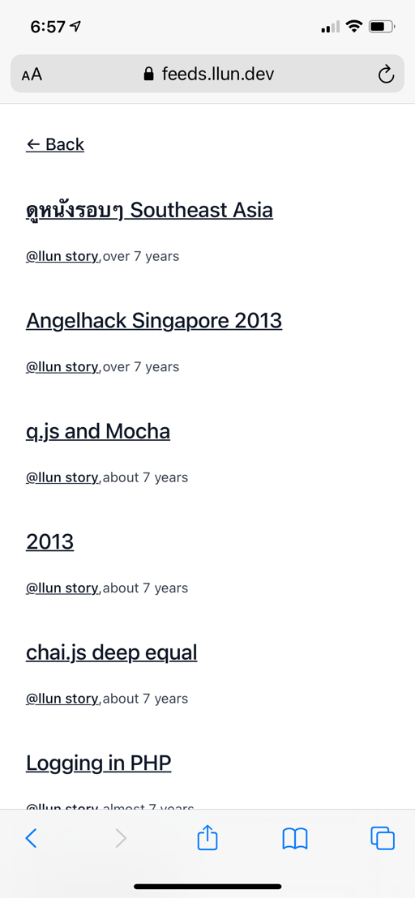
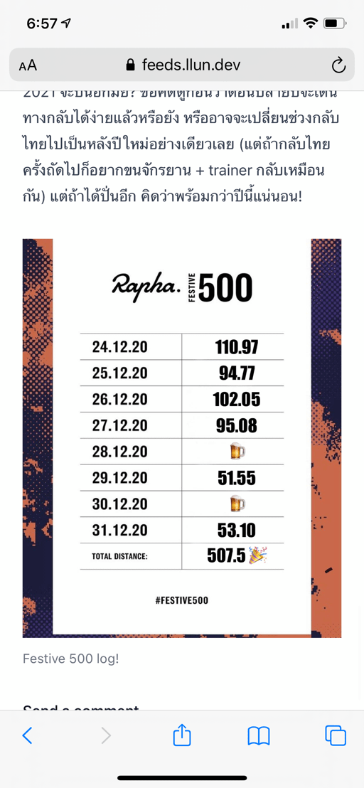

ประมาณต้นปีที่ผ่านมารู้สึกว่าใช้ Feedly ที่สมัครไว้อยู่ไม่คุ้ม คือจ่ายเป็นรายปีไว้ก็ไม่ได้รู้สึกว่าเยอะเท่าไหร่ และเว็บที่ตามส่วนตัวก็ไม่เยอะขนาดนั้นเลยลองไม่ต่อสมาชิกไป ก็รู้สึกว่าชีวิตไม่ได้ต่างจากเดิมเท่าไหร่แต่รำคาญที่ Feedly มีโฆษณาแทรกเว็บไซต์ที่ไม่ได้อยู่ใน sources ให้เห็นบ้างบางครั้ง ซึ่งจะไม่รู้สึกอะไรเลยถ้ามันหลากหลายและโฆษณาเกี่ยวข้องกับหมวด feed ที่ดูอยู่แต่โฆษณาที่ลงใน Feedly ส่วนใหญ่ดันเป็นพวก Bitcoin exchange เลยเริ่มรำคาญและหาบริการอื่นทดแทน

ก็หาอยู่ประมาณนึงจนไปเจอ [Feedbin](https://feedbin.com/) ที่หน้าตาคล้ายกับ [Reeder](https://reederapp.com/) ก็เลยคิดว่าจริงๆ มันก็ไม่น่าจะทำยากอีกอย่าง Github Actions ก็ฟรีแล้ว function หลักๆ ที่ตัวเองใช้ก็แค่ตามข่าวล่าสุด ไม่ได้มี bookmark หรือ search งั้นก็ทำเองเลยดีกว่า (ก่อนจะทำเองจ่ายให้ Reeder ไปก่อนแล้วด้วยนะ)

Concept ก็ง่ายมาก GitHub Actions อ่าน feeds source ใน repository จากนั้นก็ดึง rss ล่าสุดมาแล้วก็อ่านแปลงให้เป็น html ธรรมดาไว้สำหรับดูรวมๆ กัน วันแรกเริ่มทำได้ Feeds fetcher มาอย่างรวดเร็วเพราะง่ายมาก ไม่ต้องทำอะไร แค่อ่าน OPML แล้วใช้ curl หรืออะไรก็ได้ไปดึง XML file ออกมา ไอ้ที่เริ่มยากคือ parse RSS/Atom file แต่วันนี้ทำเสร็จจนคิดว่าเอาออกมาโชว์ได้หละหน้าตาประมาณด้านล่างนี้ หรือลองเข้าไปดูได้ที่ [feeds.llun.dev](https://feeds.llun.dev)

[](desktop.png)

หรือถ้าจะดู source ก็ไปดูได้ที่ [Github นี้](https://github.com/llun/feeds) ส่วนตัวอย่างเว็บมาจาก [Github นี้](https://github.com/llun/personal-feeds)

Features กีมีแค่ประมาณ

1. อ่าน Sources จาก OPML file ออกมาได้
2. ดึง Feeds มาให้ด้วย Github Action
3. อ่าน RSS กับ Atom ได้
4. รองรับไปอ่านบน มือถือได้

### อ่าน OPML file

OPML หรือ Outline Processor Markup Language เป็น format XML กลางที่ Feeds Aggregator หลายที่ใช้ ตอนแรกก็คิดอยู่ว่าจะกำหนดรูปแบบ input sources เองดีมั้ยเพราะ OPML ถ้าให้เขียนเองก็คงไม่ชอบเท่าไหร่ แต่เนื่องจากใช้ Feeds Reader เจ้าอื่นอยู่ด้วยพอ export ออกมาง่ายๆ ก็เลยคิดว่า support OPML ไปก่อนละกัน ถ้ามีเวลาค่อยมาคิดอีกทีว่าจะทำยังไงให้ setup sources ง่ายกว่านี้

### Github Action

เป้าหมายส่วนตัวคือทำยังไงให้ไม่เสียเงินน้อย และมี Feeds Aggregator ที่ยังดึงข้อมูลได้เร็วอยู่ ตอนแรกก็คิดว่าจะไปใช้ AWS Lambda แต่ไหนๆ Github ก็มี Github Action ให้ใช้ฟรีอยู่แล้ว ก็เลยไม่รู็จะไปใช้อย่างอื่นให้เสียตังทำไม
ตอนนี้ทำเสร็จแล้วก็คิดว่า ถ้า Github Action ทำได้ขนาดนี้แล้ว จริงๆ เอาไปใส่ CI อื่นที่ให้บริการฟรีกับ public repository ก็ได้นี่นา ก็อาจจะไว้ลองกับ CI อื่นอีกที ที่มีระบบ cron ดีกว่านี้

### RSS/Atom

จะเป็น Feeds Aggregator ก็ต้องอ่านสองอย่างนี้ได้ ไม่งั้นก็ไม่มีประโยชน์เท่าไหร่ ถ้าไปดู spec [RSS](https://validator.w3.org/feed/docs/rss2.html) หรือ [Atom](https://tools.ietf.org/html/rfc4287) จะรู้สึกว่ามี element ไม่เยอะมาก แต่เว็บไซต์ทั่วไปดันไม่ได้ใช้ element พวกนี้อย่างเดียว ดันมี element พิเศษที่เพิ่มขึ้นมาอย่าง `content:encoded` หรือ `dc:date` ซึ่งถ้าอ่านแค่ element มาตรฐาน content ที่ได้ก็จะน้อยนิดยิ่งกว่าสรุปของสรุป จนสุดท้ายก็ต้องมายอมอ่าน tag พวกนี้ด้วย

นอกจากนี้บางเว็บก็จะไม่ใช้ element อย่าง published แต่ใช้ updated อย่างเดียวซึ่งก็อาจจะพอเข้าใจได้แต่ก็ต้องคอยเช็ค fallback ไปหาแต่ละค่าแทน

ตอนนี้ก็คิดว่าอ่าน Feed เว็บส่วนใหญ่ได้แล้ว แต่ถ้ามีปัญหาเว็บไหนก็ลองส่งแจ้งมาได้ที่ [Issues](https://github.com/llun/feeds/issues)

### รอบรับไปอ่านบนมือถือ

นี่ก็ปี 2021 แล้ว เรื่องนี้ก็คงเป็นอะไรที่ต้องเป็นพื้นฐานแล้ว แต่อาทิตย์ที่แล้วที่ทำมายังไม่รองรับมือถือ คืออ่านได้แต่ต้องคอยเลื่อนหน้า page เอา พึ่งมาทำเสร็จอาทิตย์นี้ หน้าเว็บทั้งหมดมันไม่ได้ซับซ้อนเท่าไหร่ แต่ก็มีเรื่องจุกจิกให้คิดพอสมควร

[](mobile-category.png)
[](mobile-site-list.png)
[](mobile-content.png)

## ระหว่างทาง

ด้วยจะทำเป็น Github Workflow ใส่ใน repository ก็เหมือนจะธรรมดาไป (จริงๆ อยากลองทำ Github Action ดูนั่นแหละ) เลยลองเขียนเป็น Github Action ที่สามารถเอาไปทำงานบน repository อื่นหรือ project คนอื่นได้ วิธีทำ Github Actions ก็ไม่ยากเท่าไหร่ จะใช้ node.js หรือทำเป็น Dockerfile ขึ้นมาก็ได้ เริ่มจากสร้าง `action.yml` ไฟล์แล้วบอกไปว่า จุดเริ่มต้นของ action จะให้ทำอะไร อย่าง [project ที่ทำอยู่](https://github.com/llun/feeds/blob/main/action.yml)ก็บอกว่าให้เรียก `index.js` ขึ้นมาทำงาน

ปัญหาที่ไม่ชอบอย่างนึงสำหรับ Github Action ที่เขียนด้วย node.js คือ dependencies ทั้งหมดมันต้อง commit ไปใน repository ด้วย คิดว่าข้อดีก็คงเป็นทุกอย่างถูก freeze ไว้ตลอด แต่ repository ก็จะใหญ่มาก ส่วนตัวที่ทำก็เลยให้ node.js ที่ถูกเรียกมาให้ทำงาน install dependencies เองนั่นแหละ แล้วก็คอยระวังไม่ ใส่ require dependencies ไว้ที่หัวไฟล์ของ index

อย่างอื่นที่พึ่งรู้คือ Github Action สามารถรับ input และส่งออก output ไว้ไปให้ action อื่นใช้ได้ด้วย แต่ตัว feed fetcher ไม่ได้กะว่าจะเอา output ส่งไปให้ action อื่นเลยไม่ได้เล่นส่วนนี้ วิธีใช้ input ก็เริ่มจากประกาศใน `action.yml` ไว้ว่าจะมีตัวแปรอะไรบ้างที่คนเอาไปใช้ต้องใส่ไว้ใน workflow มี option เป็น description และ default value ที่ Github จะใส่เข้ามาให้ถ้าไม่ระบุใน workflow

```yml
inputs:
  opmlFile:
    description: >
      OPML file with list of feeds and category
    default: 'feeds.opml'
  outputDirectory:
    description: >
      Static feeds output directory
    default: 'contents'
  branch:
    description: >
      Output branch
    default: 'contents'
  token:
    description: >
      Github token for pulling repository information
    default: ${{ github.token }}
  customDomain:
    description: >
      Enable custom domain name for the site generator
    default: ''
```

ตัวแปรที่เจ๋งแล้วพึ่งเจอคือ `github.token` เป็นตัวแปรที่เอาไว้ใช้คุยกับ Github API ได้สำหรับแก้ไข repository เป็นตัวแปรที่ไปเจอมาจาก github checkout และ push action พวก default value ทั้งหลายคือส่งมาให้ตั้งแต่เริ่มต้นก่อนที่ action จะเริ่มเลย

วิธีใช้ตัวแปรเหล่านี้ใน Action มีสองวิธี คือจะเรียก environment variable ตรงๆ ก็ได้ โดย Github ใช้ format `INPUT_<Capital case variable name>` เช่น `omplFile` ถ้าจะเอาค่าออกมาด้วย node โดยไม่ใช้ Github action library เลยก็เรียก `process.env['INPUT_OPMLFILE']` เอา ได้ค่าเหมือนกับที่ใช้

```js
const core = require('@actions/core')
core.getInput('opmlFile', { required: true })
```

เพราะใน [code ด้านใน core](https://github.com/actions/toolkit/blob/main/packages/core/src/core.ts#L85-L86) ก็ใช้ท่าเดียวกัน สิ่งที่ทำเพิ่มมาให้คือแค่ check ว่าต้อง throw error มั้ยถ้ามี option required แค่นั้นแหละ

นอกจากตัวแปรพิเศษแบบนี้แล้ว Github Action ก็ยังอยู่ใน path พิเศษแยกจาก code ที่อยู่ใน repository ด้วย แต่ทำงานที่ path เดียวกับ code ที่ checkout มา​ (ถ้าใช้ github checkout action)

โดย path ที่ code action อยู่ (สำหรับ node.js เท่านั้น ถ้าใช้ Docker คิดว่าอยู่ต่างออกไป) อยู่ที่ `/home/runner/work/_actions/<action repo>/<version/branch>` เช่น `/home/runner/work/_actions/llun/feeds/main` แต่ path ที่ action ถูกเรียกขึ้นมาทำงานจะอยู่ที่ `/home/runner/work/<workspace repo>` เช่น `/home/runner/work/llun/feeds` ถ้าไม่ได้ทำอะไรพิเศษกับ action ก็คงไม่มีปัญหาอะไร รวมทั้ง commit dependencies ใส่ไว้ใน Github Action ด้วยแต่ถ้าจะติดตั้ง dependencies แยกทีหลัง หรือ generate static content ผ่าน action path พวกนี้เลยสำคัญขึ้นมานิดนึงเพราะ เวลาทำอะไรต้องคอยระบุว่าจะทำที่ path ไหน

หลังจากทำ action เสร็จแล้วเอาไปใช้จริงก็ต้องเอาไปต่อกับ Github workflow schedule ตามเอกสารที่ Github ให้มาบอกว่าเวลาที่สั้นที่สุดที่กำหนดได้คือ [ให้เรียกทำงานทุก 5 นาที](https://docs.github.com/en/actions/reference/workflow-syntax-for-github-actions#onschedule) หรือ `*/5 * * * *` แต่เท่าที่ลองมา ไม่เคยสั้นกว่า 1 ชั่วโมงเลย แล้วยิ่งใส่ให้ซับซ้อนบางที่ไม่ทำงานเลยก็มี เช่น `0,15,30,45 * * * *` หลังจากพยายามแก้อยู่ซักพัก ตอนนี้ก็ยอมแพ้ ให้มันเรียก feeds ทุกชั่วโมงไปนี่แหละ ยังไงก็ไม่ได้รีบอ่านข่าวด่วนขนาดนั้นอยู่แล้ว แต่ถ้าจะแก้จริงๆ ทางเลือกที่มีอยู่ก็อาจจะไปทำ Cloudwatch Cron ให้มา commit empty commit ทุก 5 นาทีเอา แต่คิดว่าเจ้าของเว็บไซต์ใน sources อาจจะไม่ชอบแทน

### [Tailwind CSS](https://tailwindcss.com/)

CSS Framework น้องใหม่ที่พึ่งได้ลองเล่น ตอนแรกคิดว่ามันจะเหมือน [Bootstrap](https://getbootstrap.com/) หรือ [Foundation](https://get.foundation/) แต่วิธีใช้มันต่างออกไปแบบสิ้นเชิง จนกว่าจะรู้สึกชินก็ใช้เวลาพอสมควร

ปกติแล้วเวลาเขียนเว็บและเปลี่ยนหน้าตา ก็จะเริ่มจากกำหนดลักษณะของ element ที่ต้องการด้วย CSS เช่นอยากได้กล่องสี่เหลี่ยมพื้นหลังสีแดงกว้างเท่ากับครึ่งนึงของ element ก่อนหน้าและมีระยะช่องว่างนอกกล่อง 10px ก็จะเขียนพร้อมระบุชื่อ class ประมาณนี้

```css
.box {
  width: 50%;
  background-color: red;
  margin: 10px;
}
```

แล้วถึงเอาชื่อ class ใน CSS file มาใส่ใน HTML element

```
<div>
  <div class="box"></div>
</div>
```

แต่ Tailwind บอกว่าแทนที่จะทำอย่างนั้น เราทำ class สำเร็จรูปพร้อมใช้มาให้หมดแล้ว ไม่ต้องไปประกาศอะไรแบบนั้นให้วุ่นวายใน CSS อีกต่อไปจาก กล่องสี่เหลี่ยมด้านบนก็ใส่ชื่อ class กับ HTML element ไปแบบนี้เลย

```
<div>
  <div class="w-6/12 bg-red-600 m-2.5"></div>
</div>
```

ซึ่งมันดูไม่ชินมาก แต่ Tailwind ก็มีท่าให้สามารถเอาชื่อ class มาใช้ได้แต่ใช้ syntax พิเศษของตัวเองที่เรียกว่า apply

```
.box {
  @apply w-6/12 bg-red-600 m-2.5
}
```

แล้วก็เอาชื่อ class box ไปใช้เหมือนเดิม ซึ่งมันก็มีหลายท่าให้เล่นแต่รวมๆ แล้วก็คือยังไม่ชินกับวิธีนี้ ส่วนที่ชอบก็คงเป็นไม่ต้องคิดว่าจะใช้ component ชื่ออะไรเหมือน Bootstrap หรือ Foundation อยากได้อะไรเราก็เอาส่วนย่อยๆ ของ Tailwind ที่ทำมาให้แล้วรับรองว่าดูดี มาใส่ๆ ประกอบกัน (แต่ Bootstrap/Foundation ก็มี utility class ที่คล้ายกันอยู่เพียงแต่ไม่เยอะเท่า เท่านั้นเอง)

## ต่อจากนี้

ยังมีสองสามอย่างที่ยังรู้สึกขัดใจอยู่ใน version นี้

1. Icon/Logo! อยากมี logo แปะหน่อยแต่ก็ห่วยเรื่องพวกนี้เหลือเกิน ไว้เดี๋ยวไปหาคนช่วยทำแล้วเอามาแปะ
2. คิดอยู่ว่าจะทำให้ UI มัน customize ได้ดีมั้ย โดยกำหนดไปเลยว่าต้องทำ ไฟล์อะไรบ้างใน directory ไหนของ repository ปลายทาง
3. ก่อนที่จะแปลงเป็น single page app ปุ่ม back ใน browser มันใช้ได้ ตอนนี้มันใช้ไม่ได้ แล้วเล่นบนมือถือมันน่าหงุดหงิดมาก คิดว่าเดี๋ยวจะหาทางเอากลับมา
4. Freeze! กดว่าจะดูเนื้อหาไหนแล้วมันเหมือนค้าง แต่จริงๆ Javascript มันโหลดให้อยู่ด้านหลัง เดี๋ยวคงใส่ loader status ไปให้ดูว่าเห้ยทำงานอยู่นะ

ข้อ 1 กับ 2 นี่คงอีกนาน แต่ 3 กับ 4 คงเร็วๆ นี้แหละ
