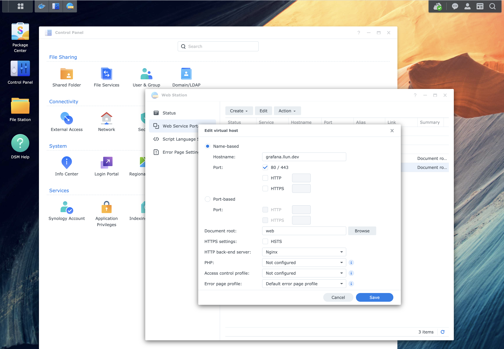

อัพเกรด DSM7 มาได้ซักพักแต่พึ่งได้มาลองแก้ vhost เพราะจะเล่น Grafana แล้วพบว่า Synology
เปลี่ยน structure nginx config จากเดิมอยู่ที่

```
/etc/nginx/app.d/server.webstation-vhost.conf
```

ย้ายมาอยู่ที่

```
/etc/nginx/sites-enabled/server.webstation-vhost.conf
```

ถ้าไม่เล่น docker จะไม่ต้องเข้ามาแก้ไฟล์พวกนี้ตรงๆ เพื่อ reverse proxy เลยแต่จริงๆ Synology
ควรเพิ่ม Reverse proxy option ลงไปใน Web station ได้แล้วจะได้ไม่ต้องมาแก้อะไรแบบนี้เอง

[](vhost.png)
