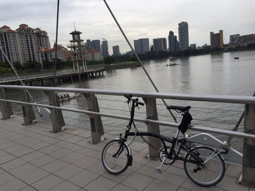
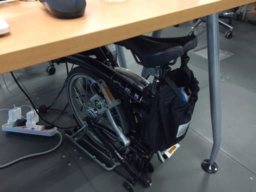
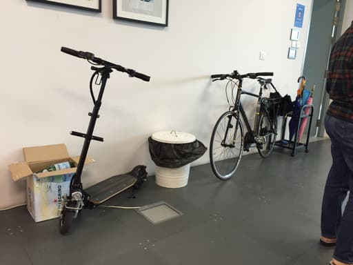

Today makes me cycle to work for 1 year and complete a goal last year that I started with learning to cycle. From March to April I fall a few times with a minor injure (which actually more serious than last February this year that I got hit by car) and getting a bike. My requirement for the bike that time is very simple, compact and can get on the MRT. The choices at that time are from Tern Link to Dahon which mostly less than S$1,000 but someone suggested me to get a Brompton and somehow after saw it in Carousell made me own it in just a few days later.

It’s the first bike and I thought most expensive bike at that time, with second hand price S$2,000 made me think that I would cycle this every day to work for at least one year. So in the first month after I got this one I cycled it almost every day.

In the beginning, I planned to cycle to work in the morning and take the MRT back with bike but in the end I took it to the MRT only 2 or 3 times. I founded out it’s too troublesome to carry on to the MRT station even the bike is just 12kg but it’s not really that convenient like I thought and some time you cannot carry the bike on because it’s too packed and in the rush hour, you even cannot enter to the MRT station (which make sense because the train will be very packed at that time.) In the end only when I cycle to very far distant e.g. Pungol and too lazy to cycle back that’s time I will take the MRT home.

<figure style="display: flex; flex-direction: column">
  <iframe height='405' width='590' frameborder='0' allowtransparency='true' scrolling='no' src='https://www.strava.com/activities/297717880/embed/d2fc226725d110ea391ce75d6ffaa24f06e37dca' style="margin-bottom: 0.5rem; border:"></iframe>
</figure>

First few trip route (like above) I took has a lot zigzag, and mostly on the pedestrian path. So from circuit road, I went down to Sims Dr road and go out to Geylang road which need to cycle on the road for short distant and get on the pedestrian path again and go on it to Clark quay. It’s very slow because on the pedestrian there’re a lot of people walking, also sometime the there’s a slow to go up and down and some slope is not build for the wheel. So few days later, it became like this.

<figure style="display: flex; flex-direction: column">
  <iframe height='405' width='590' frameborder='0' allowtransparency='true' scrolling='no' src='https://www.strava.com/activities/304889870/embed/dec609f3178a02fd711ab62d15617daed239eda7' style="margin-bottom: 0.5rem; border:"></iframe>
</figure>

I’m afraid of cycle on the road for few days but later I feel it’s more safe than cycle on pedestrian because less sudden change direction like people and most of them are aware and give some space for me. After that I added more gadgets like lighting (actually should install this from the first few days) and camera, found out less car is coming to my lane and mostly will slow down even I don’t record the video. So cycle here (in Singapore) is very safe compare to Bangkok and Thailand which at that time there’re many news about the cyclist got hit by cars.

Parking is never be a problem for me because compactness of my bike but I found out it’s quite hard to park it in Singapore. I’m rarely see the place to lock it when cycle to work. Some building might have a bicycle parking lot but still most people lock the biked with the public bar even there’s a sign telling this place is not for parking the bike.

In HDB also, I see only few bicycle parking bar to lock the bike and it’s not enough compare to people that use bicycle here, so most people carry it up and parking in front of lift on there floor. In the end it’s not seem to be a problem here. I don’t see warning sign telling about bicycle thief often now.

After few months, the biggest problem I have is the haze, It started around late September last year, I thought it might not be worse like haze in 2013 but in the end, I cannot go out and cycling. It just not smell that like something is burning but it also affect the eyesight and made me stop for one month. This year also have a little haze in the beginning of April but not worse like last year. I guess this thing will become seasoning here and maybe I should prepare to use to it or move to another city.

The other thing that made me break is accident. I got hit by a car in February this year but actually it’s not that serious but almost broke my bike. It’s happen in the place I thought should be safe to cycle on, zebra cross in the corner road. The good thing is, driver took care me everything including repairing cost and I didn’t get any serious injure that’s the best. So I guess I have some luck at that time.

Now, after one year, I’m still continue cycling to work. It might not that often compare to last year but it’s still fun for me and actually want to cover the cost of my bike. So commute to work everyday cost me around S$3 now I cycle it around 200 days, total is S$600 now. I still need another 2 years to cover the cost so, let see I guess I will continue cycling to work at least another 2 years and if I still in Singapore.
