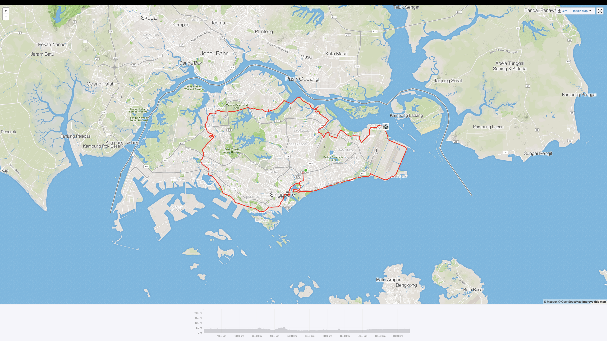
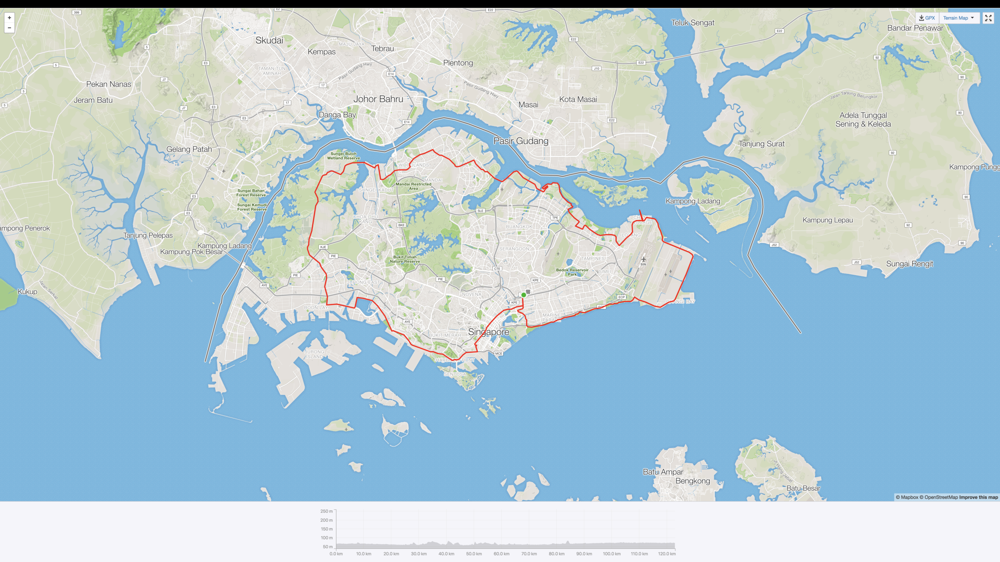
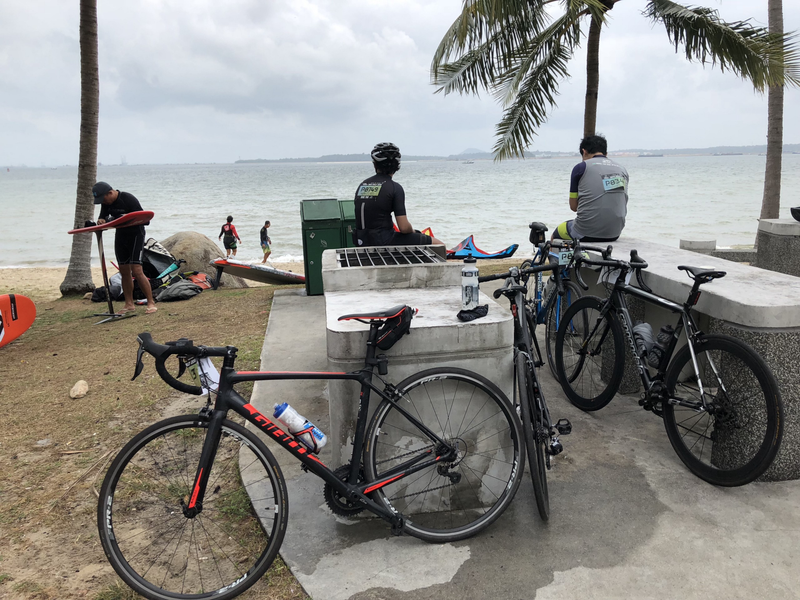
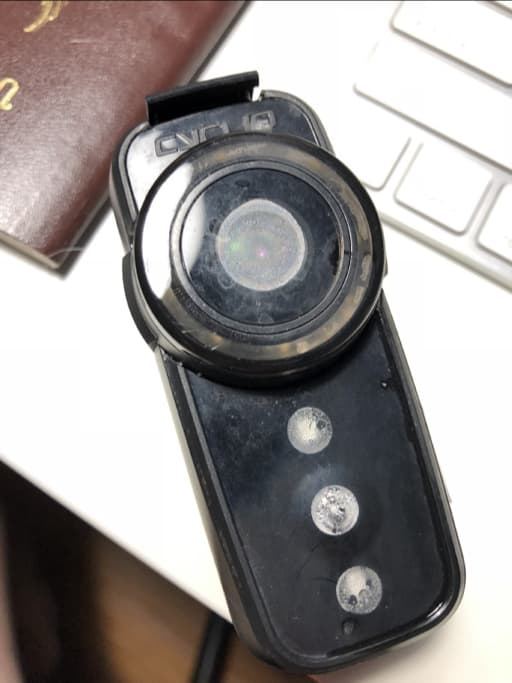
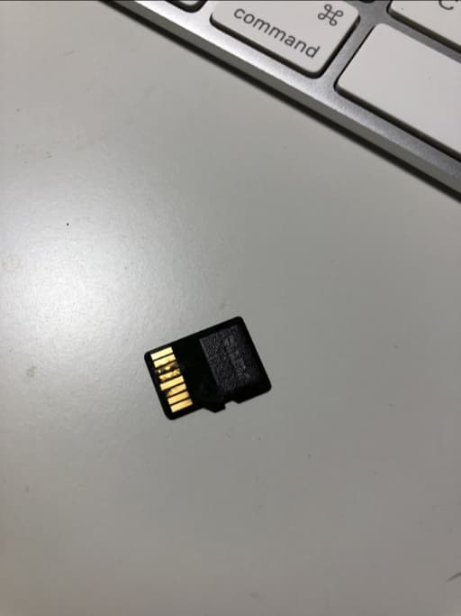

This is second bike event I joined and it is quite unorganised when compare to the first one. No close road, cycling with the normal traffic which is fine for me. In the website, there is no route or detail much about event and the detail about collecting race pack is come in when I was traveling and no alternative option other than let someone else collect for you. I have to keep asking them to know I can collect in days later.

## On the event day

It starts with a heavily rain and the whole ride is going between wet and dry. The route is actually very similar to my Singapore round island route except it is not going to Lim Chu Kang road and cut to Choa Chu Kang instead. (178km is going to Lim Chu Kang but go further left to the Taus area first) The checkpoints is almost every 15–20km. I don’t see the first one that nears west coast park and just follow the group. Another checkpoint is easy to see because it on the route itself or I’m very tired and keep looking for it in the late ride.

The route looks like this

compare to my Singapore route in September 2017

Surprise thing for this event is I see many are using foldable bike with 100km it seems harsh. Also 1 couple use tandem and cycling together! that’s double the difficulty especially with the climb in Mandai.

## After ride

It took me around 5 hours (6 if include breaks) to finish this event. Which almost the same as when I cycling myself. I might join this event again (probably a bigger one 178km!!) Only thing I don’t like is the weather but that’s uncontrollable anyway. One issue after the event is I got sun burn! The raining that happen for the whole event wasn’t really help, my both arm is really red after the ride.

## Fly12ce and Fly6ce

This ride is happen to be a good test for my new safety camera too. Fly12ce is really good. It can record the whole ride including good image that can see the plate and environment clearly.

<figure style="display: flex; flex-direction: column">
  <iframe width="560" height="315" src="https://www.youtube-nocookie.com/embed/hp7bXJghwF4" frameborder="0" allow="accelerometer; autoplay; clipboard-write; encrypted-media; gyroscope; picture-in-picture" allowfullscreen style="margin-bottom: 0.5rem; max-width: 100%;"></iframe>
  <figcaption>You can see from above video, even with heavy rain it still work perfectly.</figcaption>
</figure>

However, it is opposite story for the Fly6ce. The camera is stop working around 80% of my ride. The issue is not the camera itself but somehow, water can get into the device and make my SD Card temporary not usable. The camera itself also get water inside and picture is very foggy. The good thing is this is under the warranty and Cycliq send a new unit for me. (Which seems has the same issue)

<figure style="display: flex; flex-direction: column">
  <iframe width="560" height="315" src="https://www.youtube-nocookie.com/embed/EfXnQ5Zjo2s" frameborder="0" allow="accelerometer; autoplay; clipboard-write; encrypted-media; gyroscope; picture-in-picture" allowfullscreen style="margin-bottom: 0.5rem; max-width: 100%;"></iframe>
  <figcaption>Fly6ce video, it starts getting foggy around half of the ride.</figcaption>
</figure>

and my SDCard looks like this

I’m not sure how the water get in. I hope it’s not getting really bad again with my second unit.

## Next

So after this event, I have another one coming soon in 24 March 2018 but this time in Bintan and it’s shorter (a bit) just 82km! Will try record the whole ride again. Hopefully, not raining and more fun than this one.

[The whole ride record for this event is here.](https://www.strava.com/activities/1444877464)
