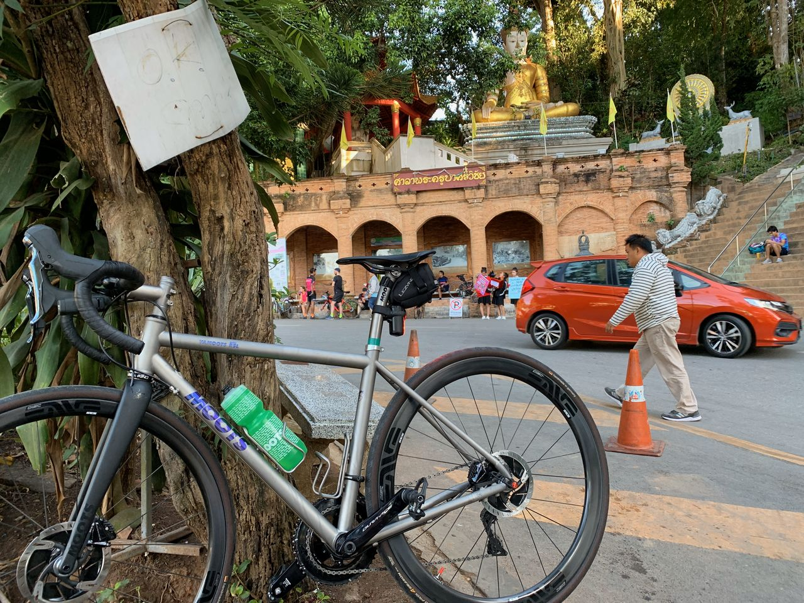
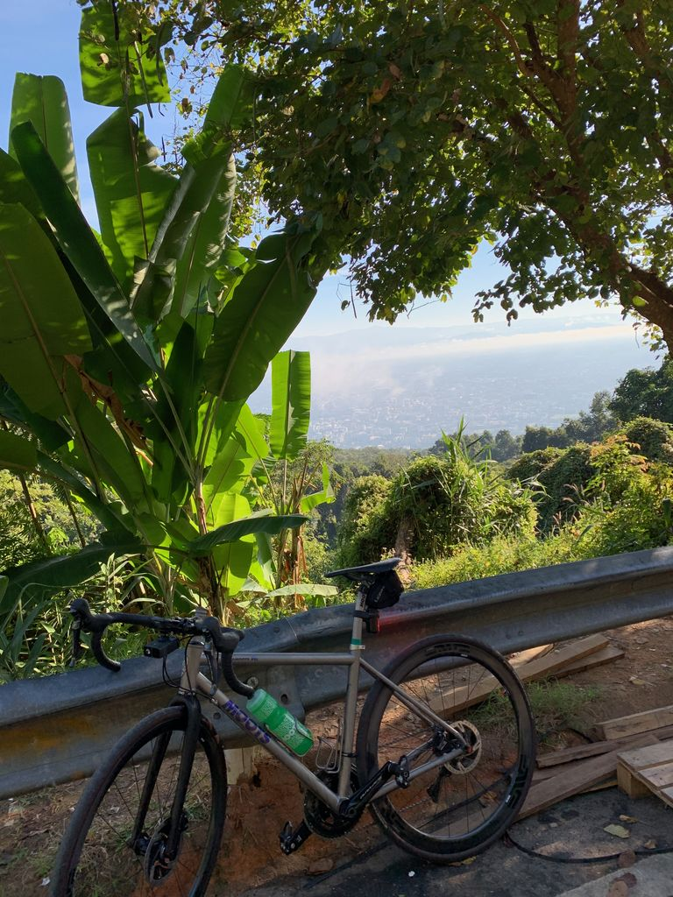
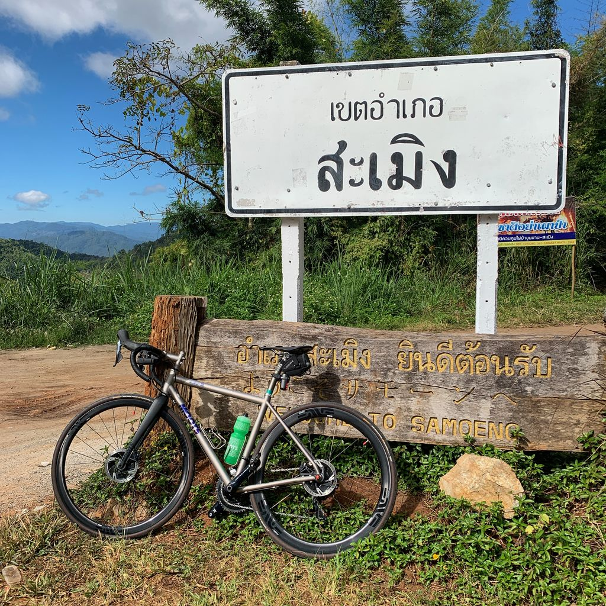
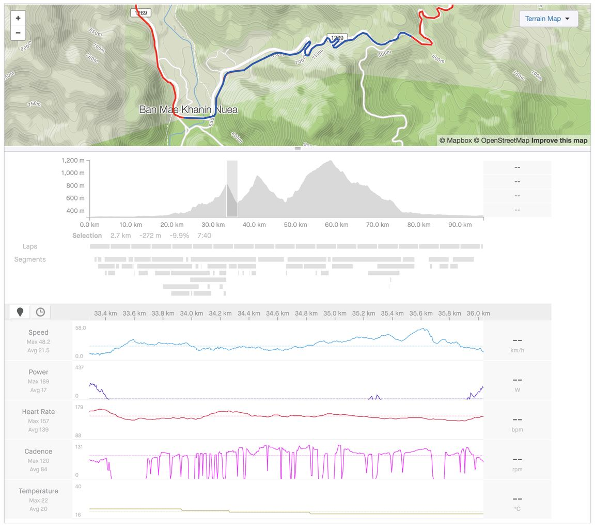
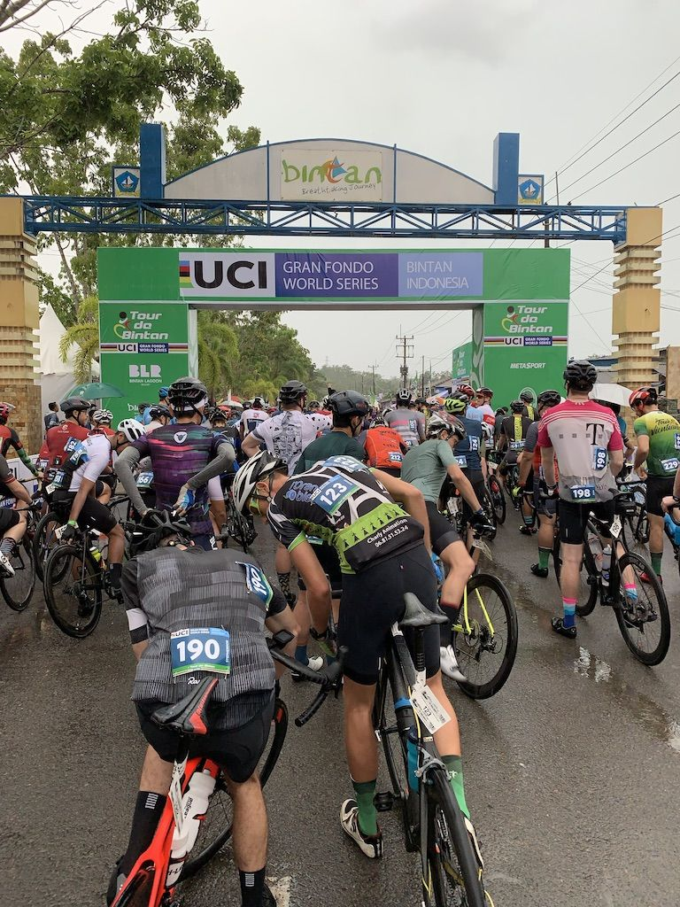
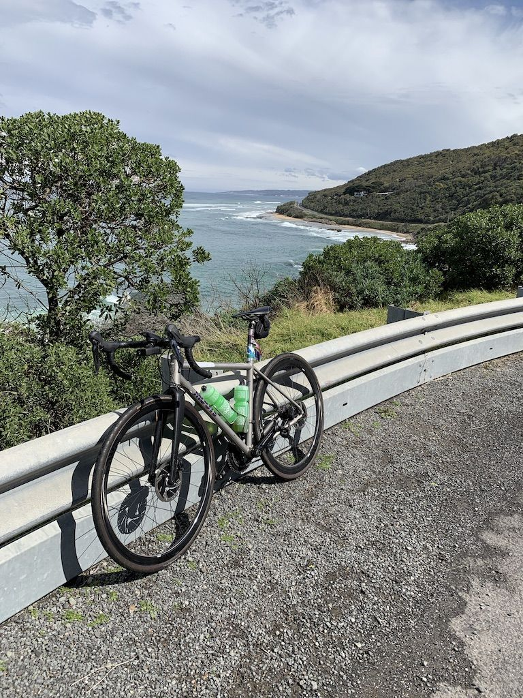

หลังจากปีที่แล้วไปลองปั่น Tour de Bintan แบบ 82 กิโลเมตรแล้วปั่นจบ เลยคิดว่าจะลองมาปั่นแบบเต็มระยะปีนี้ ระยะทางปั่นปีที่แล้วดูไม่เยอะแต่ที่ทำให้เหนื่อยคือเนินตลอดเส้นทาง เทียบกับสิงคโปร์แล้ว เรียกว่าเยอะกว่ากันมาก (สิงคโปร์ปั่นรอบเกาะประมาณ 100 กิโลเมตรขึ้นลงเนินแค่ประมาณ 300 เมตร เทียบกับ Tour de Bintan 82 กิโลเมตร ขึ้นลงเนินประมาณ 800 เมตร) หลังจาก Tour de Bintan ปีที่แล้วเลยลองปั่นยาวๆ เพิ่มขึ้น กับลองไปปั่นที่เชียงใหม่ดู

)](tourdebintan-challenge.jpg)

## เตรียมตัว

ระยะทางที่เพิ่มมาจาก 80 กิโลเมตร เป็น 140 กิโลเมตรนี่คือเกือบเท่าตัว + เขา ที่เพิ่มเป็นสองเท่าเหมือนกัน ปีที่แล้วเลยฟิตปั่นหลังจาก Tour de Bintan เยอะมาก แต่เนื่องจากสิงคโปร์เป็นประเทศที่แทบไม่มีเขาเลย มากสุดคือปั่นรอบเกาะเอาแค่ระยะเอา ปลายปีก็เลยลองแบกจักรยานไปเชียงใหม่ กะว่ามาลองฝึกปีนเขาที่นี่แหละ

### ดอยสุเทพ

บินมาถึง เขาที่ปีนได้ใกล้สุดก็ดอยสุเทพ ดูแผนที่จากโรงแรมขึ้นไปจนถึงพระธาตุดอยสุเทพแค่สิบกว่ากิโลนิดๆ คิดว่าสบายมาก ร้อยกิโลรอบเกาะก็ปั่นมาแล้ว ผลคือจอดแทบตลอดทาง ปีนขึ้นภูเขา กับเนิน Bintan นี่ต่างกันลิบลับ Bintan นี่ยังกดขาปั่นให้ถึงยอดเนินเร็วๆ ได้แถมไม่ชันมาก ดอยสุเทพนี่ ไม่มีลงมีแต่ขึ้น กดไปยังไงก็ตายกลางทาง วันแรกกว่าจะถึงพระธาตุพักไปหลายรอบ ที่โหดสุดคือเนินสุดท้ายก่อนถึงประธาตุที่ชันสุด ปั่นขึ้นจนถึงบันได้วัดก็เลิกแผนที่จะลองปั่นไปดอยอินทนนท์ทันที

)](doi-suthep-route.jpg)

หลังจากปั่นดอยสุเทพได้ ก็คิดว่าลองไปปั่นสะเมิงดูหน่อยละกัน มันคงไม่โหดกว่านี้แล้วหละ

### สะเมิง

เส้นสะเมิงนี่ลองกดดูตาม Activity ใน Strava แล้วเห็นว่าระยะเกือบเท่า Tour de Bintan ที่ปั่นตอนต้นปี ก็คิดว่าไม่น่ายากหรอก Bintan ก็ปั่นมาจบแล้ว แต่ลืมดูระยะปีนทั้งหมดกว่าเท่าไหร่ กับความชัน เส้นนี้พักตลอดทางเช่นกัน แต่ที่โหดกว่าดอยสุเทพตรงที่ เส้นนี้ยาวกว่าเยอะ และหลายจุดชันแบบน่ากลังมาก

จุดที่คิดว่าน่ากลัวสุดคงเป็นเจ็ดพับ จริงๆ ถ้าปั่นขึ้นคงไม่น่ากลัวเท่าไหร่ (แต่คงพักมันทุกพับ) แต่ตอนปั่นลงต้องคอยกดเบรกตลอดทาง และความเร็วแทบไม่ลดเลย คือจะกดหนักก็กลัวจะหัวทิ่ม คราวหน้าไปอีกคงไปกับกลุ่มแล้ว ไม่ซ่าไปปั่นคนเดียวแบบนี้อีก

ที่โหดต่อมาคือหลังจากเจอป้ายสะเมิงแล้ว พลาดลงไปทางตัวอำเภอสะเมิง แทนที่จะวกกลับเข้าตัวเมืองเชียงใหม่ กลับขึ้นมาตรงทางแยกได้ พักตรงร้านน้ำยาวๆ เลย ไม่คิดว่าจะได้ฝึกปีนเขาเยอะขนาดนี้ แต่พ้นจากช่วงนี้ไป ก็ลงยาวๆ จนถึงตัวเมือง สรุประยะปีนทั้งหมด 1400 เมตร เยอะกว่า Bintan เกือบเท่าตัว

)](samoeng-loop.jpg)

หลังจากสะเมิงที่เหลือก็ปั่นแค่ในตัวเมืองกับดอยสุเทพเอา ไม่ปั่นเดี่ยวแบบนี้อีกแล้ว แต่คิดว่าพร้อมแล้วสำหรับ Bintan classic คิดว่าคงไม่ยากไปกว่าสะเมิงแล้วหละ

# Tour de Bintan classic

หลังจากเตรียมตัวมาประมาณปีนึง ก็คิดว่าพร้อมแล้วหละ 140 กิโลเมตร ปีนขึ้นลงอีกประมาณ 1400 เมตร แต่ไม่ชันเท่าสะเมิง แถมมีจุดพักมีทั้งน้ำ ขนม กล้วยตลอดทาง ก่อนวันปั่นก็นอนเตรียมอย่างดี พอวันปั่นเท่านั้นแหละฝนตก ตกแบบหนักขนาดมองไม่เห็นทางจนผู้จัดต้องเลื่อนเวลาเริ่มปั่นไปชั่วโมงนึง (หรือชั่วโมงกว่าไม่แน่ใจ)

ส่วนตัวคิดว่าง่ายกว่าสะเมิงหน่อยนึง และเพราะฝนตกด้วยทำให้อากาศไม่ร้อนเกินไป คือถ้าไม่มีฝนเลย ตอนต้นๆ อาจจะปั่นได้เร็วแต่ไปตายหอบแดด อยู่ช่วงท้ายๆ แทน แต่พอฝนตกขนาดนี้เลยปั่นจบ แบบไม่รู้สึกตัวไหม้เท่าไหร่ (รอบนี้ทากันแดดมาเต็มที่ด้วย ตัวก็ยังไหม้อยู่แต่น้อยกว่าปีที่แล้ว)

](tourdebintan-classic.jpg)

ปั่นจบก็กลับมาที่พัก กินน้ำ กินเบียร์กับเพื่อน แล้วก็แผ่ยาวถึงเย็น

### จุดพัก

อย่างนึงที่ชอบใน Tour de Bintan คือจุดพักระหว่างทาง รู้สึกว่าทำดี ระยะทาง 140 กิโลเมตร มีจุดแวะพักประมาณ 6 - 7 จุดได้ หรือประมาณ 20 กิโลเมตรต่อจุดแวะพักนึง และที่จุดแวะพักสามารถหยิบกระบอกน้ำของผู้จัดงานไปได้เลย ไม่ต้องลงมาเติมน้ำ แบ่งชัดเจนว่าเป็นน้ำเปล่าหรือ น้ำเกลือแร่ (ส่วนตัวหยิบน้ำเปล่ากลับมาเพราะสีดูดีกว่าแบบเกลือแร่ และอยากเก็บเป็นที่ระลึกด้วย)

นอกจากน้ำ ก็มี kueh cake กับกล้วย ที่ไม่มีหมด

### โรงแรม

ส่วนตัวไม่ค่อยชอบโรงแรมเท่าไหร่ เพราะห้องเก่ามาก แต่ข้อดีของโรงแรมปีนี้คือไม่ต้องต่อ bus จาก ferry ลงมาก็ถึงโรงแรมเลย ปีหน้า (2020) เพื่อนที่จะไปอีกกะว่าจะเช่าแบบบ้านที่อยู่ในพื้นที่โรงแรม แล้วไปพักรวมกันแทน แทนที่จะพักเป็นห้อง ก็หวังว่าจะดีกว่าปีนี้

ตอนนี้ลงทะเบียนปีหน้าไว้เรียบร้อยแล้ว ลงแบบ Classic เหมือนเดิมเพราะเวลาปีนี้ห่วย ก็หวังว่าจะได้เวลาที่ดีขึ้น

# Amy's Gran Fondo

หลังปั่นจบปีนี้ก็หาว่าอยากลองไปปั่นประเทศอื่นบ้าง ก็ลองเปิดเว็บ [GranFondo guide](http://granfondoguide.com/) ดู ที่สนใจจริงๆ ก็มี Niseko กับ Amy's Gran Fondo แต่ Niseko Classic รู้สึกว่าเวลามันใกล้กับ Tour de Bintan ไปเตรียมตัวไม่ทัน ก็เลยลง Amy's Gran Fondo ท้ายปีแทน

สมัครเสร็จก็ดูว่าเส้นทางเป็นไง ก็เห็นก่อนเลยว่า Amy's นี่น่าจะโหดกว่า Tour de Bintan แน่เพราะเป็นเขาสองลูก ปั่นขึ้นยาวๆ ประมาณ 10km ต่อลูก แต่ระยะทางสั้นกว่า Tour de Bintan ก็คิดว่าคงจะปั่นจบแหละ ซึ่งก็ปั่นจบ แต่ช้ากว่า Tour de Bintan พอสมควร

](amysgranfondo.jpg)

เทียบกับ Bintan ที่ขึ้นลงเป็นเนินเล็กๆ เต็มไปหมด ส่วนตัวชอบ Amy's มากกว่านิดนึงเพราะเนินเล็กๆ ไม่ค่อยมี ตอนปีนเขาก็เหนื่อยแต่พอลงยาวๆ ก็หายเหนื่อยที ยิ่งเขาลูกสุดท้าย ลงมาเจอ Great Ocean Road นี่เขาที่ปีนมาก่อนหน้าลืมไปเลย

สิ่งที่ตรงข้ามกับ Tour de Bintan อีกอย่างคืออากาศ Bintan ให้ฝนตกยังไง ก็ไม่หนาวเท่าไหร่ และก็ยังปั่นได้ชิวๆ แต่ Amy's เนื่องจากจัดอยู่ซีกโลกใต้ Melbourne พึ่งออกจากฤดูหนาว อุณหภูมิเลยต่ำพอสมควร เริ่มปั่นออกจาก Lorne อุณหภูมิอยู่ประมาณ 13ºC พอปั่นถึงกลางทาง ฝนตก! อุณหภูมิก็ลดต่ำลงเรื่อยๆ จนไปบนยอดเขามีทั้งลม มีทั้งฝน มีทั้งหมอก ต่ำสุดอยู่ที่ 9ºC มาปั่นงานนี้ ถ้าไม่ได้ซื้อ winter jacket กับ winter glove วันก่อนปั่นคิดว่าอาจจะปั่นไม่จบ เพราะหนาวและเปียก

### จุดพัก

เทียบกับ Bintan แล้วจุดพัก Amy's น้อยกว่ามาก 130 กิโลเมตรมีจุดพักทั้งหมดแค่ 5 จุด และขนมถ้าไปช้าบางจุดจะมีไม่พอให้กิน ต้องเลยไปจุดถัดไปแทน​ (ซึ่งก็ต้องทำเวลาอีก)​ และด้วยอากาศที่ไม่เหมือน Bintan เลยรู้สึกว่าใช้พลังงานในการปั่นเยอะกว่า กว่าจะถึงแต่ละจุดพักก็หิวหละ กินแค่กล้วยไม่พอ

น้ำงานนี้ไม่มีกระบอกน้ำแจกแบบ Bintan มีเป็นถังน้ำใหญ่ๆ ให้เอาขวดไปเติมเอง ข้อดีอย่างนึงคือกระบอกที่โยนทิ้งข้างทางแบบ Bintan แต่ส่วนตัวก็ชอบ Bintan มากกว่า

# 2020

ปีหน้า ตอนนี้ก็ลง Tour de Bintan อีกรอบไปแล้ว แต่ยังคิดว่าอยู่ว่าอีกงานจะไปไหนดี ระหว่าง Niseko Classic หรือ RBC GranFondo Whistler

Niseko ดูเส้นทางแล้วเหมือนโหดกว่า Amy's ขึ้นอีกเพราะปั่นขึ้นเขาเยอะกว่าเดิม (Amy's ปั่นขึ้น 1800 เมตร, Niseko อยู่ที่ประมาณ 2100 เมตร, Tour de Bintan ปั่นขึ้นประมาณ 1400 เมตร) ส่วน RBC นี่ยังไม่รู้รายละเอียดเท่าไหร่แต่ปีหน้าเหมือนจะมีแข่งรายการใหญ่ (ซึ่งแน่นอน ไม่ไปแข่งด้วย ปั่น 120 - 140km + ขึ้นเขา 1500 เมตรเฉลี่ย ใน 4 ชั่วโมงนี่โหดเกิน) ไว้คิดอีกทีหลังจบ Tour de Bintan ปีหน้า
