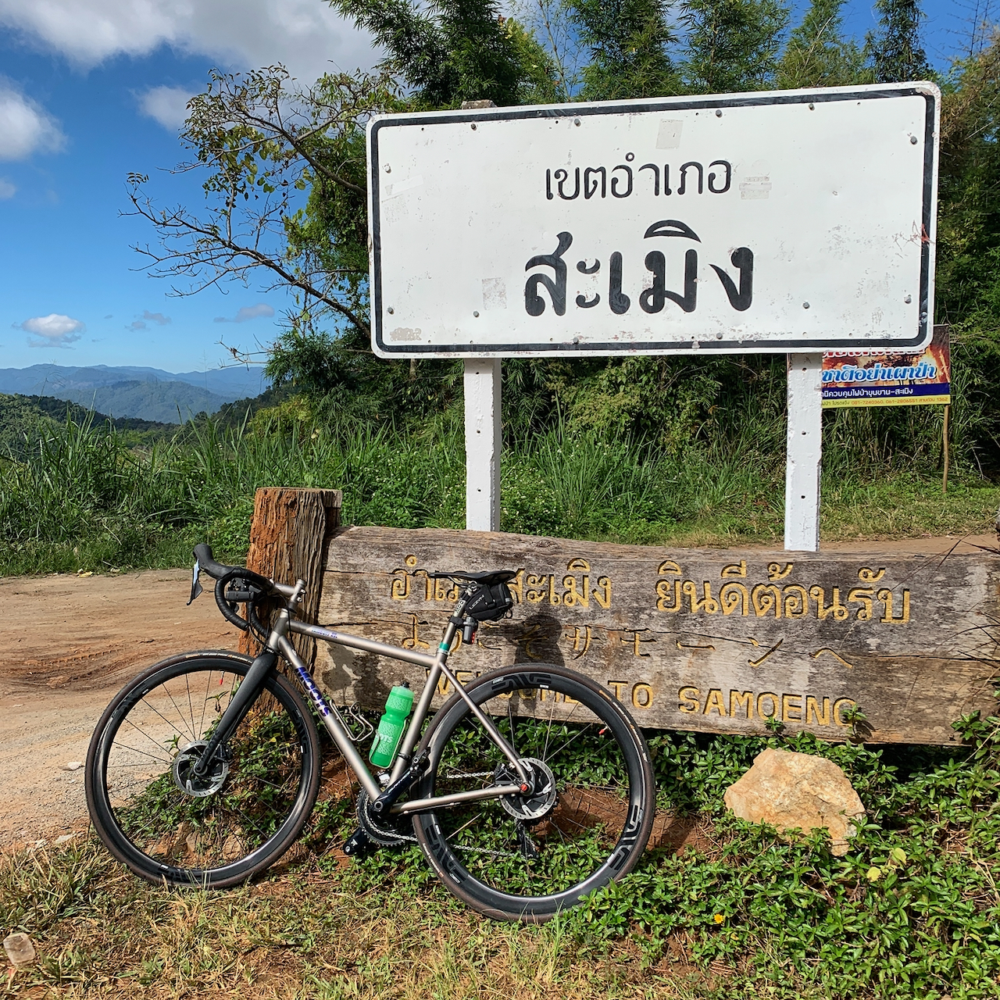

ตอนเปลี่ยนจักรยานจาก Giant เป็น Moots ตั้งใจไว้ว่าคันนี้จะเป็นคันสุดท้ายและไม่ซื้อคันใหม่อีกแล้ว ผ่านมาปีกว่าก็ยังชอบอยู่และปั่นมา 10,000 กิโลเมตรแล้วเลยเขียนเก็บไว้เป็น milestone เสียหน่อย

ตอนซื้อตั้ง spec ไว้คร่าวว่าต้องเป็น Titanium ด้วยเหตุผลว่าตัวเองไม่ค่อยระวังอยากได้วัสดุทนๆ ที่ไม่ต้องกลัวถลอกหรือหัก และเบรกต้องเป็น disc brake เท่านั้นเพราะตอนปั่น rim brake ลุยฝนแล้วเบรกแทบไม่มีผล และปีก่อนๆ สิงคโปร์ฝนตกบ่อยเลยอยากได้ disc brake ไว้อุ่นใจ (ปีถัดมาฝนแทบไม่ตก!) ตัวเลือกจักรยาน Titanium ตอนไปเลือกที่ร้านก็มีอยู่สามเจ้า T-Lab, Moots แล้วก็ Passoni แต่ตัวเลือกในใจตอนนั้นมีแค่ Firefly, No.22 แล้วก็ Moots อยู่แล้วสุดท้ายเลยได้ Moots มา

หลังจากเลือกรุ่น กับอุปกรณ์อื่นๆ (handlebar, groupset, stem, seatpost etc) ก็รอไปประมาณสามเดือน ระหว่างนั้นก็มีต้องเปลี่ยน seatpost เพราะที่เลือกไว้เป็น seatpost สำหรับ saddle รางโลหะแต่ saddle ที่เลือกเป็นราง carbon ก็เปลี่ยนรุ่นอัพเกรดไป แต่คิดไปแล้วก็อัพเกรด groupset เป็นรุ่นบนไปด้วยเลยดีกว่าเลยเปลี่ยนจาก Ultegra เป็น Dura ace ซะ (ถ้า Sram AXS มาตอนนั้นคงได้เลือก Sram AXS แทนหละ)

สรุป spec จักรยานทั้งหมด

- Frame Moots, Vamoots RSL disc มีแต่ง anodize ลาย + แปะชื่อตัวเองบน frame!
- Group set, Dura ace 9100 mechanic ตอนนี้ก็ยังชอบมากกว่าแบบไฟฟ้าอยู่ ไม่ต้องกลัวถ่านหมด
- จานหน้า 52/36, ก็ยังคิดว่าอยากได้ 50/34 compact สุดไปเลยอยู่ ยิ่งตอนไปปั่นสะเมิงยิ่งอยากได้ sub-compact
- เฟืองท้าย 11-30, Dura ace สุดได้แค่นี้! ถ้าเป็น Ultegra คงได้เลือก 11-34 ไปแล้ว
- อานนั่ง Fizik Antares 00
- ยาง Continental Grand Prix 4-Season! จะลุยแค่ไหนก็ไม่มีแบน! เคยเอาไปวิ่ง Gravel มาแล้วคนอื่นแบนไปสอง แต่ 4-Season เอาอยู่
- ล้อ Enve 3.4 Disc, ชอบที่ขอบไม่ลึกไปแต่เจอลมแถม Changi ก็มีเป๋อยู่เหมือนกัน
- บันไดจักรยาน Shimano Dura ace!
- Fork Moots! ตอนนี้ถลอกเยินมาก พอๆ กับ frame เพราะขนไปปั่นเยอะแล้ววางตอนไม่มีล้อไม่ระวังไปหน่อย
- Stem Moots Ti-Stem 90mm
- Handlebar Zipp SL-70 Ergo, ร้านก็ถามนะทำไมไม่เอาแบบ Aero ไปเลย แต่ไหนๆ จักรยานก็ไม่ Aero แล้วก็ขอ bar แบบกลมดีกว่า

ผ่านมา 10,000km มีเปลี่ยนไปสองสามอย่าง

- บันได้เปลี่ยนก่อนเพื่อนหลังจากเจอ Favero Assioma เปลี่ยนหลังจากปั่นไปได้ประมาณ 1,500km
- brake pad ทั้งสองล้อเปลี่ยนตอนประมาณ 6,000km แต่ล้อหน้าพึ่งเปลี่ยนอีกรอบไม่นานหลังจากผ่านไปอีก 3,500km หลังๆ ก็พยายามใช้เบรกหน้าให้น้อยลง รู้สึกเปลืองผ้าเบรกไปหน่อย
- โซ่ เปลี่ยนตอนประมาณ 7,000km จริงๆ ควรเปลี่ยนก่อนหน้านั้นเพราะช่วงหลังๆ ก็รู้สึกว่ามันยืดแบบรู้สึกได้ตอนถีบบันไดหละ พอครบปีเอาเข้าร้าน ร้านก็บอกว่ามันยืดมากแล้ว แล้วก็เปลี่ยนให้เลย
- สายเกียร์หน้า ขาด! ขาดแบบกลางทางกำลังกลับบ้านด้วย เลยได้เปลี่ยนตอนประมาณ 6,000km
- สายเกียร์หลัง โดนร้านจับเปลี่ยนตอนเอาเข้าร้านครบปีตอนประมาณ 7,000km

ค่าอะไหล่พวก brake, สายเกียร์, โซ่ พวกนี้ไม่เท่าไหร่ถ้ายังปั่นโหดอยู่คิดว่าอาจจะได้เปลี่ยนเร็วขึ้นด้วย

## 10,000 km ปั่นไหนมาบ้าง

- Singapore 9,370km
- Chiangmai 306km
- Melbourne 280km
- Bintan 140km

เดือนหน้ามีไปปั่น Bintan อีก 140km แล้วคิดว่าจะไป Gran Fondo อีกซักประเทศ แต่ส่วนใหญ่ก็คงยังเยอะอยู่กับสิงคโปร์อยู่ 10,000km ถัดไปก็คงไม่ต่างจากนี้เท่าไหร่

เป้าหมายส่วนตัวคือจะปั่นคันนี้ให้ได้อย่างน้อย 100,000km ตอนนี้ก็ 1/10 หละแต่กว่าจะครบก็คงอีกหลายปี หวังว่าตอนนั้นคงได้ข้ออ้างในการ upgrade จักรยานจาก Moots เป็นคันอื่นหละ (เล็ง Firefly ไว้อยู่นะ 😉)
