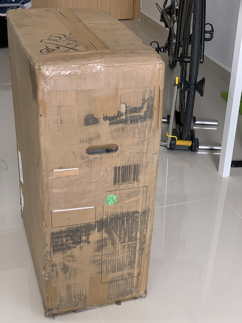
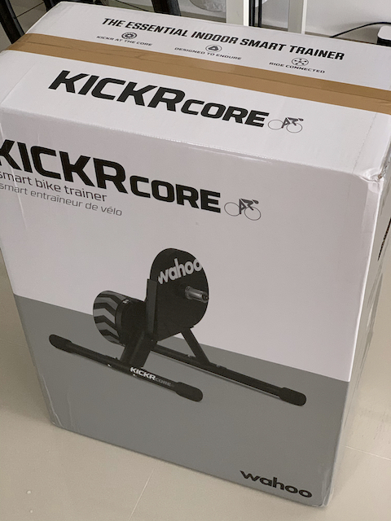
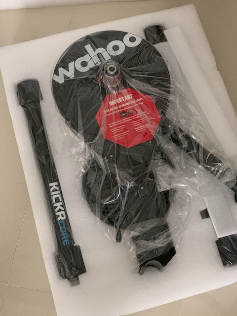
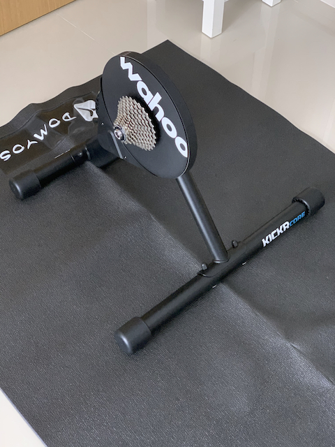
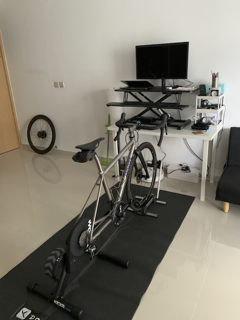
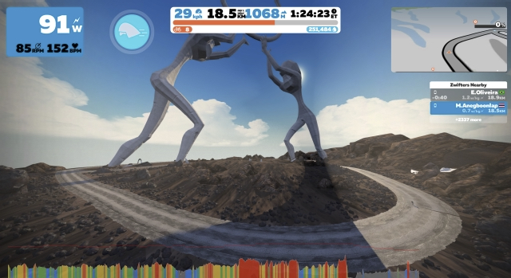

หลังจากเล็ง bicycle trainer ไว้อยู่นานตอนแรกคิดว่าจะซื้อไว้ที่ไทยเผื่อแบกจักรยานกลับไทยแล้วไม่ออกไปไหนก็ปั่นอยู่ที่บ้านแต่กลายเป็นว่าพอ Covid19 ระบาดและสิงคโปร์ปิดเมืองเลยต้องเปลี่ยนแผนซื้อปั่นอยู่ในห้องที่นี่แทน (ส่วนเป้าหมายปีนี้ที่ตั้งใจว่าจะไม่ซื้อของเล่นจักรยานก็ล้มเหลวไปเรียบร้อย)

ตอนที่คิดจะซื้อก็ก่อนที่สิงคโปร์จะประกาศ Circuit Breaker แป๊บนึงแต่เห็นราคาแล้วยังไม่ค่อยอยากซื้อเท่าไหร่ และคิดว่าคงปิดไม่นาน กะรอว่าหลัง Circuit Breaker แล้วคงมีคนปล่อยเยอะแหละ แต่พอเริ่มปิดเมืองแต่เห็นคนยังออกมาเยอะอยู่ก็คิดว่าปิดยาวแน่ๆ เลยเริ่มหาซื้อแต่ก็ช้าไปแล้วเพราะที่ขายในประเทศหมดทุกร้าน แม้แต่รุ่นทีแพงๆ ยังหมด เลยลองหาในเว็บต่างประเทศอย่างร้านจักรยานใหญ่ๆ (Wiggle, Evan Cycle) หมดทุกร้าน ส่วนที่ order ไปในประเทศบอกว่าของมากลางเดือนเมษา สุดท้ายบอกเลื่อนไปประมาณพฤษภาคม เลยยกเลิกไป (ตอนนี้ถ้าสั่งคือได้หลังมิถุนาเลย) แล้วโชคดียังไงไม่รู้อยู่ดีๆ Google โฆษณามาว่าร้าน [R&A Cycles](http://racycles.com) มีขายอยู่นะ และส่งสิงคโปร์ด้วย ก็เลยได้ Kickr Core มาในราคาถูกกว่าสั่งในประเทศนิดนึง (แต่เดี๋ยวรอดูภาษีนำเข้า คราวนี้ fedex ยังไม่ส่งมาว่าโดนไปเท่าไหร่ คิดว่าช้าเพราะ Circuit Breaker) + ค่าส่งแบบโหดที่เข้าใจได้ สั่งไปประมาณวันอังคารได้มาวันเสาร์ที่แล้ว ทันสิงคโปร์ประกาศกระชับ Circuit Breaker พอดี ถ้าใครคิดจะสั่งเข้าไปดูตอนนี้คิดว่าไม่ทันแล้ว เพราะหลังจากสั่งไปประมาณสองวัน ของก็หมด และน่าจะหมดยาวเหมือนเจ้าอื่นๆ

## KICKR CORE

ตอนหา Trainer มีเล็งไว้หลักๆ ประมาณสองเจ้า Tacx กับ Wahoo สุดท้ายมาจบที่ Wahoo เพราะหาซื้อ Tacx ตัวถูกไม่ได้ตามร้านจักรยานที่เหลือให้เลือกอยู่เหลือแต่ Neo2T ที่หนัก น้ำหนักนี่เป็นประเด็นเพราะเนื้อที่ในห้องจำกัด เลยต้องคอยเก็บตลอดหลังเลิกเล่น เลยกะว่าเอาตัวกลางๆ ที่สามารถขนย้ายได้ไม่ยาก

หลังจากของส่งมาถึงห้อง พบว่าตัว KICKR CORE ก็หนักอยู่ดี แต่ที่ลำบากคือไม่มีหูให้ถือเหมือนตัว KICKR เวลาแบกเลยรู้สึกลำบากเล็กน้อย แต่ที่คิดคือขนาดตัวกลางยังหนักขนาดนี้ (ประมาณ 18 กิโลกรัม) ตัว KICKR ที่ fly wheel หนักกว่านี้น้ำหนักรวมจะขนาดไหน (ส่วน Neo2T หนักกว่า KICKR อีก)

ปัญหาอีกอย่างของ KICKR CORE ที่ไม่คิดว่าจะเจอคือวิธีอัพเดท firmware แย่กว่าตัว head unit มาก (ส่วนตัวใช้ Wahoo Elemnt Bolt อยู่) เพราะต้องใช้มือถือส่ง firmware ไปที่ตัว Trainer แต่ด้วยเหตุผลอะไรไม่รู้ update fail ไปประมาณครึ่งชั่วโมง ต้อง reboot มือถือใหม่หนึ่งรอบเพื่อ reset bluetooth หลังจากนั้นต้องมา spin down ซึ่งก็ล้มเหลวอีก ค้างอยู่หน้าตัวเลขหลังจากปั่นถึงความเร็วที่กำหนดแล้ว (36kph! ทำไมต้อง spin ไปถึงความเร็วนี้ด้วย เหนื่อย) แต่หลังจาก update firmware กับ spindown เสร็จตอนนี้ก็ยังไม่เจอปัญหาอะไร

## Zwift

หลังจาก setup trainer เสร็จแล้วก็เหลือเกมที่ใช้คู่กัน เกมที่เพื่อนเล่นเยอะสุดตอนนี้คงเป็น Zwift ตอน setup ก็ไม่ยากมากติดตั้งเกมเสร็จ pair sensor trainer เข้ากับเกมก็เสร็จ จากนั้นก็เลือกฉากปั่นได้เลย

ส่วนใหญ่ที่ปั่นในสิงคโปร์จะเป็นทางราบซะส่วนใหญ่ คือปั่นไกลยังไงก็ยากที่จะปีนเข้าถึง 1,000 เมตรแต่ในเกมทางส่วนใหญ่ตรงข้ามกับสิงคโปร์ มีเขาเยอะมากและบางช่วงชันแบบขึ้นดอยสุเทพ และ trainer ที่ซื้อมาก็รองรับจำลองความชันพวกนี้และได้ใช้จนคุ้มเลย ตัวเกมมีให้เลือกว่าให้ trainer จำลองความชันแบบจริงๆ หรือเอาแบบง่ายเป็นทางราบหรือป่าว ค่าเริ่มต้นคือ 50% ยากกลางๆ คือ ความชันที่แสดงในเกมเท่าไหร่หารสอง เช่นเห็นว่า 15% หารสองก็เหมือนปีนเขาที่ความชัน 7.5% (ซึ่งก็โหดมากหละ) แต่ตัวละครในเกมจะปีนให้ระยะทางต้องใช้กำลังวัตต์เหมือนปั่น 15% เท่าเดิมแค่ทำให้ไม่ต้องออกแรงปีนเท่าความชันจริงแค่นั้น (15% นี่จะให้วิ่งได้ความเร็ว 10kph น่าจะต้องออกแรงอย่างน้อย 400 - 500 วัตต์) แล้วเนื่องด้วยเป็นคนไม่ชอบปีนเขานัก ก็เลยเลือกไว้ที่กลางๆ นี่แหละ

ปั่นในเกมมาประมาณสองอาทิตย์แล้วอย่างนึงที่รู้สึกคือ ฉากในเกมเล็ก คิดว่าเล็กกว่าสิงคโปร์เพราะว่ากว่าจะปั่นให้ได้ 100km ต้องปั่นทับเส้นทางเดิมอย่างน้อยสองรอบ อย่างเส้น Mega Pretzel ที่เป็นเส้นระยะ 108km คือวิ่งไปกลับเส้นทางเดิมผ่านเขาลูกเดิมสองรอบ แม้จะมีเมืองอื่นๆ ให้ลองไปปั่นแต่เมืองอื่นระยะทางก็สั้นกว่าฉากหลักอย่าง Watopia อีก เทียบกับปั่นรอบเกาะในสิงคโปร์ที่ปกติจะปั่นทุกเดือน ระยะทางประมาณ 110km คือไม่มีวิ่งทับเส้นเดิมเลย

นอกนั้นก็เหมือนเกมทั่วไปมีเก็บเลเวล สะสมของ ซื้อของ เพียงแต่ว่าไม่มีใช้เงินจริง จะซื้อของได้คือต้องปั่นให้ได้เหงื่อเท่านั้น และกว่าจะได้เพื่ออัพเกรดล้อ อัพเกรดเฟรมก็ต้องปั่นเยอะหรือปีนเยอะพอสมควร เพราะของที่อัพเกรดดันใส่ได้ตามเลเวลอีก จักรยานดีๆ ล้อดีๆ นี่อยู่เลเวลกลางๆ สูงๆ ทั้งนั้น (15+) ตอนนี้ปั่นมาเกือบ 500km ยังอยู่แค่เลเวล 10 ส่วนเหงื่อเหมือนจะได้มาง่ายหน่อย แค่ลง event บางอย่างหรือปั่นให้ถึงเลเวลหาร 5 หรือ 10 ลงตัวก็ได้มา 25000 (5, 15, ...) หรือ 100,000 (10, 20, ...) แล้วเลยเอาเงินฟาดซื้อของไม่ลำบากเท่าไหร่ ที่เจ๋งอย่างคือถ้าปั่นครบ 50km หรือ 100km มี badge + xp พิเศษให้ด้วย เล่นพวกนี้ทำให้ level เพิ่มขึ้นเร็วหน่อย แต่ของที่อัพเกรดมาก็ไม่ได้ทำให้เร็วขึ้นหรือปั่นง่ายขึ้นเท่าไหร่ ส่วนมากไว้ให้ดูเท่มากกว่า ยกเว้นจะไปปั่นแข่งแล้วชิงกันที่ 5 วิแต่ถ้าไปปั่นแข่งนี่คือต้องขาแรง ออกให้ได้ประมาณ 3+w/kg เป็นนาที ที่ตอนนี้ทำได้อย่างมากก็ไม่เกิน 5 นาที (3+w/kg คือออกแรกให้ได้ 3+ วัตต์ต่อน้ำหนักตัวหน่วยกิโลกรัม อย่างหนัก 60kg ก็ออกไปประมาณ 180w แต่ถ้าลงแข่งจริง ขาแรงส่วนใหญ่ก็ 200w+ หรือโปรก็ 300w+)

## เกมอื่นๆ

นอกจาก Zwift ก็มีเกมอื่นๆ อีกที่ต่อกับ trainer ได้ ลองดูในเว็บแล้วมีเยอะมาก แต่ที่สนใจนอกจาก Zwift ตอนนี้มีแค่ FulGaz ที่จำลองถนนจริงมาให้ปั่น และในเกมมีให้ลองปั่นเส้น Amy's Gran Fondo ที่ไปปั่นปีที่แล้วด้วย! ไว้เบื่อ Zwift คงได้ลองไปเล่น (หรือเผื่อลง Amy's อีกปี)

นอกจาก FulGaz ที่เห็นเพื่อนเล่นใน Strava ก็มี RGT และ Trainer road แต่ดูจากจำนวนคนเล่นใน feed แล้วไม่เยอะเท่าไหร่ ส่วน Trainer road มันดูสำหรับเล่นหัดออกกำลังกายจริงจังมากกว่า เลยไม่ชอบ (ต้องปั่นให้ได้วัตต์เท่านี้ กี่นาที ทำซ้ำกี่รอบ...) หรือถ้าจะหัดออกแรงใน Zwift ก็มี training mode ให้เลือกเป็นโปรแกรมให้ลองเล่นอยู่แล้ว เลยไม่คิดไปเล่นเท่าไหร่

## ปั่นในบ้าน vs นอกบ้าน

ปั่นในบ้านมาได้สองอาทิตย์แล้ว ก็ยังชอบเวลาออกไปปั่นนอกบ้านอยู่ ความต่างอย่างแรกเลยคือ ลม ในบ้านเวลาปั่นมันอยู่กับที่เลยไม่เจอลมมาปะทะตัวให้รู้สึกเหมือนโดนดันกลับอยู่ตลอดเวลาเหมือนปั่นบนถนน เวลาหายใจเลยง่ายกว่า และรู้สึกออกแรงไปกับขาได้เยอะกว่า แต่มีปัญหาอื่นมาแทนคือเหงื่อ พอไม่มีลมคอยพัดเอาเหงื่อออกจากตัวมันก็ลงพื้นท่วมเสื่อออกกำลังกายหรือ ลงบนจักรยานนั่นแหละ แล้วมันเปียกไม่เหมือนตอนออกไปปั่นข้างนอก เอาพัดลมที่มีอยู่เป่าก็ไม่ช่วยอะไรเท่าไหร่

อีกอย่างคือเปลืองไฟพอสมควรเพราะปั่นในบ้านอย่างนึงที่ต้องเปิดตลอดคือแอร์ ไม่งั้นร้อนเกินที่จะออกกำลังกายไหว เทียบกับนอกบ้านมีลมคอยลดความร้อนให้ตลอดเวลา อาจจะไม่เย็นเท่าแอร์แต่เสื้อกับ bib ไม่เปียกเลยรู้สึกสบายกว่า

แต่ถ้าให้เทียบเรื่องความปลอดภัยคิดว่าในบ้านยังไงก็คงปลอดภัย 100% ไม่ต้องกลัวรถชน ไม่ต้องกลัวล้ม (จักรยานยึดกับ trainer ตลอดยกเว้นจะไปปั่น roller) อีกอย่างที่ปั่นในบ้านดีกว่าคือจำลองเขา กับความชัน อยากปีนกี่เมตรก็ปีนได้ มีให้ลองปีน Alpe d'Huez ด้วยที่ถ้าไม่อยู่สถานที่จริงก็คงทำไม่ได้ แต่พอลงเขาจำลองยังไงมันก็สู้ของจริง ไม่ได้เลย ลงเขาเร็วๆ 50kph+ แล้วเจอลมพัดตลอดเวลาแบบไม่ต้องออกแรงปั่น เทียบกับนั่งให้แอร์พัดในบ้านดูตัวละครบนจักรยานลงเขา มันเทียบไม่ได้จริงๆ

คิดว่าคนอื่นจะมีเรื่อง social แบบได้เจอคนมาเทียบอีกแต่ส่วนตัวชอบปั่นแบบคนเดียวอยู่แล้ว แต่ถ้าเทียบแล้วเจอคนจริงๆ ก็ยังคงดีกว่า (ปั่นกับ Rapha วันศุกร์ตอนเช้ามืดงี้ ปั่นเสร็จก็ไปกินกาแฟกับหนมปังตอนเช้าตาม partner cafe เทียบกับเจอตัวการ์ตูนกันในเกมกับ video call มันก็คงเทียบกับของจริง ไม่ได้แหละ)

สรุปว่าระหว่างปั่นในบ้านกับนอกบ้านชอบแบบไหนมากกว่ากันก็ยังคงชอบปั่นนอกบ้านมากกว่า ก็หวังว่า Covid-19 จะจบลงเร็วๆ ไม่ลากยากไปทั้งปี ไม่งั้นคงได้เฉาในเกมแน่นอน
