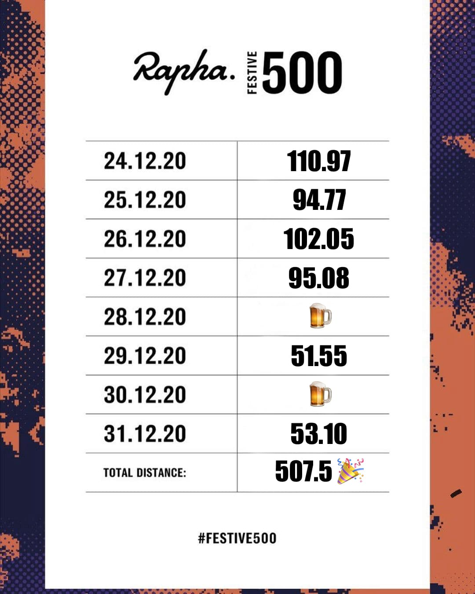

Event ปั่นจักรยานปลายปีที่แทบถือว่าจะเป็น ritual คนปั่นจักรยานจัดโดย Rapha ปีนี้เป็นปีแรกที่ไม่พลาดเพราะอยู่สิงคโปร์ช่วงปีใหม่ กติกาก็ง่ายมาก ปั่นจักรยานให้ได้ระยะทาง 500 กิโลเมตรตั้งแต่วัน Christmas Eve ถึงวันสิ้นปี จะปั่นครั้งละเท่าไหร่ก็ได้แต่ 8 วันนี้ปั่นให้ได้ 500 กิโลเมตรหรือมากกว่านั้นก็พอ

ปีก่อนๆ หน้านั้นความยากของกิจกรรมนี้คือมันต้องปั่นนอกบ้านเท่านั้น virtual ride ไม่นับ คนที่ปั่นอยู่แถบซีกโลกเหนือก็จะเจอความโหดจากถนน หิมะ และความหนาว ส่วนคนที่อยู่ทางซีกโลกใต้ก็จะได้ประโยชน์เพราะหน้าร้อนพอดี คนที่ปั่นได้ครบก็จะได้ patch ผ้าอันเล็กๆ ส่งมาที่บ้านไว้ปักแปะกับเสื้อหรืออะไรก็ได้ด้วย แต่ปีนี้ Rapha ปรับกติกาให้รวม virtual ride แล้วตัด patch ออกไปได้แค่ virtual badge ใน Strava เท่านั้น ส่วนตัวเสียใจนิดหน่อยเพราะเป็นปีแรกที่ได้ปั่น

## แผนปั่น

ปั่น 8 วัน 500 กิโลเมตรถ้าหารแล้วจะรู้สึกระยะทางไม่ได้เยอะมาก ปั่นแค่วันละ 62.5 กิโลเมตร ถ้าปั่นความเร็วกลางๆ ซัก 25 กิโลเมตรต่อชั่วโมง ปั่นประมาณสองชั่วโมงนิดๆ ก็เสร็จแล้ว (ส่วนตัวแล้วปั่นเร็วกว่านั้นนิดหน่อยแบบรวม ติดไฟแดง จอดกินน้ำบ้างแล้ว) แถมสิงคโปร์เป็นประเทศที่อยู่แถบเส้นศูนย์สูตรอีก อากาศเลยไม่หนาว และถนนก็ดีพอสมควร ไม่ค่อยมีเนินให้ปีนเหนื่อย คือไม่ราบเหมือนกรุงเทพฯ แต่ก็ไม่มีเขาให้ปีนโหดเหมือนเชียงใหม่แบบทางไปดอยสุเทพ หรือสะเมิง ก็ดูเหมือนจะง่าย แต่ให้ตื่นแปดวันตอนตีห้าเพื่อมาปั่นสองชั่วโมงทุกวันนี่ สุดท้ายคิดว่าล้าวันหลังๆ แน่นอน แถมถึงแม้สิงคโปร์จะไม่หนาว แต่ช่วงนี้ฝนตกบ่อย แล้วปั่นกลางฝนที่นี่ไม่ค่อยสนุกเท่าไหร่เพราะตกทีบางทีมองทางแทบไม่เห็น เพราะงั้นแผนปั่นเลยเป็น ปั่นยาววันละ 100km สี่วันติด แล้วเหลือ 50km ไว้อีกสองวันที่เหลือสำหรับสัปดาห์สุดท้าย

## 400km แรก

เริ่มปั่นวันแรกวัน Christmas Eve ก่อนเลย ไม่ได้หยุดด้วยแต่คิดว่าปั่นเสร็จก่อนทำงานแน่ๆ เพราะเคยปั่นมาแล้ว และยังฟิต ออกจากบ้านประมาณตีห้าครึ่งแล้วปั่นรอบเกาะเส้นทางที่คุ้นเคยไป ใช้เวลาประมาณ 4 ชั่วโมงครึ่งถึงบ้าน 10 โมงพอดี ออนไลน์ Slack เริ่มงานทัน!

[，ปั่นรอบเกาะเส้นทางที่คุ้นเคย](festive-rti-small.png)](festive-rti-full.png)

วันถัดมาหยุด Christmas ทักไปหาเพื่อนหลังจากเห็นไปปั่น TMCR สองรอบเก็บระยะเมื่อวานว่าพรุ่งนี้ไป Tuas กันมั้ย แล้วจะแวะขึ้นไป LCK ด้วยก็ได้ ระยะทางเพิ่มขึ้นไม่เยอะหรอก (แผนกลุ่มเพื่อนคือ 70km วันที่สอง) เพื่อนบอกโอเค เลยได้ไปลากปั่นกับเพื่อนวันที่สอง แต่ Tuas นี่คือแผนหลอกเพราะสุดท้ายแล้วก็เพิ่มไปอีก 20km รวมกับวันแรกก็เกิน 200km ไปนิดๆ กันหละ

[, ปั่นไป Tuas Marina แล้วย้อนกลับขึ้นไป LCK ก่อนชิวที่ Mandai](festive-tuas-lck-small.png)](festive-tuas-lck-full.png)

จบวันที่สองเพื่อนบอกว่าพรุ่งนี้จะมา Mandai อีกแต่จบวันที่สองนี่คือไม่อยากปีน Mandai แล้วเลยบอกไปว่า จะไปปั่น Changi แล้วก็ไม่เคยผิดหวังกับตัวเองที่บอกว่าจะไม่ทำอะไรแล้วทำทุกที (เหมือนกับ Festive ที่ต้นเดือนบอกว่าจะไม่เล่นก็เล่น!) ออกจากบ้านก็ปั่นไป Mandai loop ก่อนเลย ก่อนปิดท้ายปั่นไป TMCR ด้วย! จบ 300km

[, Mandai Loop ที่ตอนแรกบอกจะไม่มา + TMCR!](festive-mandai-changi-small.png)](festive-mandai-changi-full.png)

วันที่สี่ วันนี้กะวันปั่นชิวแล้ว ไม่มีเนินจริงๆ แล้วเพื่อนทักมาว่า วันนี้ปั่นสบาย Tuas - Changi มั้ยแล้วก็บอกตกลงไป ก็ปั่นสบายจริง ผลัดกันลากเพราะเพื่อนรู้ทางแล้ว จนมาถึงแถว Nicoll Highway ที่เริ่มหมดแรง พอเข้า East Coast Park ทุกคนก็ชลอปั่นช้าลงกันจนไปสุดก่อนเลี้ยวเข้า TMCR ก็แยกย้าย เพื่อนปั่นไปกันต่อถึง Changi Village แล้วกลับ รวมวันนั้น 130km แบบตัวไหม้โหดมาก คือถ้าไปปั่นด้วยอาจได้จบในวันอังคาร

[, วันที่ 4 ปั่นยาววันสุดท้ายแบบมีคนช่วยลาก ไม่งั้นอาจไปช้ากว่านี้เยอะ](festive-tuas-changi-small.png)](festive-tuas-changi-full.png)

จบสี่วันปั่นไป 400km ตามแผน แล้วตอนปั่นจบก็รู้สึกขาไม่ได้ปวดเท่าไหร่จนไปนวดเท่านั้นแหละ กดตรงไหนก็เจ็บ แต่เหลืออีก 100km กับอีกสี่วันคิดว่าสบายมาก ผ่านช่วงที่โหดสุดมาแล้ว

## 100km สุดท้าย

สี่วันทำงานสุดท้ายของปี แผนคือออกไปปั่นตอนเช้าเหมือนที่ทำเป็นประจำ เส้นทางก็มี Double Mandai กับ East Coast loop สั้นๆ ระยะแค่ 50km แต่วันจันทร์กับพุธมี schedule เข้ายิมแล้วไม่อยากให้ร่างพังเกินไป เลยงดสองวันนั้นไป ตอนแรกก็กะจะไปปั่นกับเพื่อนที่แผนคือปั่นวันอังคารกับพฤหัสด้วย แต่เพื่อนเปลี่ยนแผนเป็นปั่นรอบเกาะยาววันพุธทีเดียว สุดท้ายเลยปั่นเดี่ยวให้จบเอง

เริ่มจากปั่นสั้นวันแรก Double Mandai (ปากบอกว่าเหนื่อยกับ Mandai แต่มาปั่นบ่อยสุดหละ) ไปช้าๆ ช้ากว่าปกติเพราะยังรู้สึกว่าขาหนักอยู่

](festive-petite-double-mandai-full.png)

แล้วจบด้วยวันทำงานสุดท้าย และวันสิ้นปี กับ East Loop

](festive-petite-east-loop-full.png)

## Next time?

ปั่นเสร็จเมื่อวานก็คิดว่า ปั่น 500km ก็ไม่ยากเท่าไหร่นะ ง่ายกว่าที่คิด แต่วันที่ 4 ที่ปั่น 100km ติดต่อกันนี่คิดว่าอาจจะไม่ปั่นอีกแล้ว อย่างนึงที่คิดว่าถ้าปั่นอีกจะเปลี่ยนอะไรบ้างก็คงมีไปปั่นกับเพื่อนให้มากกว่านี้ แล้วอาจจะสลับเส้นที่เบากับขาอย่าง Tuas - Changi กับ Mandai ให้ผลัดกันแทนที่จะปั่น Mandai ติดๆ กัน

อีกเส้นที่คิดว่าจะปั่นไปแต่สุดท้ายแล้วไม่ได้ปั่นคือ Tuas lamp post no.1 ที่ปั่นไปจนสุด Tuas ล่างสุด ถ้าปั่นเส้นนั้นแล้วไปจบ Changi Village คิดว่าได้ประมาณ 100miles พอดีแน่ ไว้ร่างกายฟิต หรือ วันแรกของ Festive ปีหน้าอาจจะลองเส้นนั้นดู

2021 จะปั่นอีกมั้ย? ขอคิดดูก่อนว่าตอนปลายปีจะเดินทางกลับได้ง่ายแล้วหรือยัง หรืออาจจะเปลี่ยนช่วงกลับไทยไปเป็นหลังปีใหม่อย่างเดียวเลย (แต่ถ้ากลับไทยครั้งถัดไปก็อยากขนจักรยาน + trainer กลับเหมือนกัน) แต่ถ้าได้ปั่นอีก คิดว่าพร้อมกว่าปีนี้แน่นอน!

